# Intake Agent Solution Architecture

## 1. Executive summary

The Intake Agent is an internal enterprise application delivered through Microsoft Teams. It captures structured requirements, identifies gaps and contradictions, guides clarification, supports human review, generates approved documents, and hands approved requests to downstream systems.

The solution uses Microsoft Foundry Agent Service to host and publish a Python agent directly to Teams. Foundry and Azure Bot Service handle the Teams channel; a separate custom bot host is not required for the MVP.

The central design rule is:

> The language model may interpret and propose, but deterministic code authorizes, validates, persists, and changes state.

A Python Hosted Agent is deployed as a modular monolith. Its model-facing orchestration layer coordinates the conversation, while internal application and domain layers own templates, validation rules, lifecycle transitions, request-level authorization, approvals, idempotency, persistence, and audit history. These deterministic layers run in the same Hosted Agent process but cannot be bypassed by model-generated tool arguments. Azure Cosmos DB stores request data, Azure Blob Storage stores generated artifacts, Azure Service Bus decouples background work, and Azure Functions process documents, notifications, evaluations, and downstream deliveries.

## 2. Scope

### 2.1 In scope

- Microsoft Teams as the primary MVP channel.
- Single Microsoft Entra tenant and one enterprise organisation.
- Structured, versioned intake templates.
- Conversational data collection and clarification.
- Deterministic validation, gap detection support, and confidence handling.
- Request persistence, autosave, resume, lifecycle, and audit.
- Requester and reviewer workflows.
- Word/PDF generation and versioned storage.
- Evaluation, testing, observability, security, and release controls.
- Versioned downstream payloads and future agent-to-agent handover.
- Baseline and hardened Azure deployment variants.

### 2.2 Out of scope for MVP

- Public or multi-tenant SaaS access.
- Anonymous access.
- A standalone web user interface.
- Autonomous approval by the model.
- Unrestricted web browsing or arbitrary tool execution.
- Training a foundation model.
- Downstream integrations that have not passed contract, security, privacy, and recovery review.

## 3. Drivers and quality attributes

| Driver | Architectural response |
|---|---|
| Enterprise Teams experience | Publish the Foundry Agent Application natively to Teams using the Activity Protocol |
| Correct workflow behavior | Keep lifecycle, authorization, and validation in deterministic Hosted Agent modules rather than prompts |
| Auditability | Record user, agent, model, prompt, template, revision, command, and decision provenance |
| Data ownership | Use Foundry standard setup with customer-owned Cosmos DB, Storage, and Azure AI Search |
| Security and privacy | Entra identities, managed identity, least privilege, private data endpoints, redaction, retention, and deletion workflows |
| AI quality | Versioned benchmark data, automated evaluation, human scoring, and promotion gates |
| Recoverability | Autosave each accepted change; use idempotent commands, an outbox, queues, retries, and dead-letter recovery |
| Evolvability | Version templates, schemas, prompts, agents, tools, APIs, documents, and downstream contracts |
| Operational visibility | Correlate Teams activities, Foundry traces, domain commands, queue work, and artifacts by request ID |
| Accessibility | Prefer Teams-native interactions and test supported flows against WCAG 2.2 AA |

### 3.1 Provisional service objectives

These are initial architecture targets and must be confirmed by product owners after baseline and load testing.

| Measure | Initial target |
|---|---|
| User-facing service availability | 99.9% monthly, excluding declared Microsoft 365 and Foundry platform outages |
| Persisted command latency | 95th percentile under 2 seconds, excluding model inference |
| Agent response latency | 95th percentile under 15 seconds for normal clarification turns |
| Autosave durability | Accepted field updates persisted before success is shown |
| Document generation | 95th percentile under 2 minutes |
| Recovery point objective | 5 minutes |
| Recovery time objective | 4 hours |
| Audit event loss | Zero acknowledged state changes without a corresponding audit event |

## 4. Architecture principles

1. **Deterministic core, probabilistic edge.** Model output is untrusted input to domain rules.
2. **No direct model-to-database access.** The agent acts only through typed, allow-listed commands.
3. **Persist business state, not model memory.** A request resumes from the product data store even if a Foundry session is lost.
4. **Identity follows the action.** User-driven operations retain user context; background operations use explicit workload or agent identities.
5. **Immutable decisions and provenance.** Approved revisions and audit events are not overwritten.
6. **At-least-once delivery with idempotent consumers.** Queue redelivery must not duplicate business effects.
7. **Version every behavioral dependency.** Agent, prompt, model, template, schema, policy, tool, and benchmark versions are recorded.
8. **Private by design, observable by design.** Sensitive content is protected without removing the telemetry needed to operate the service.

## 5. System context

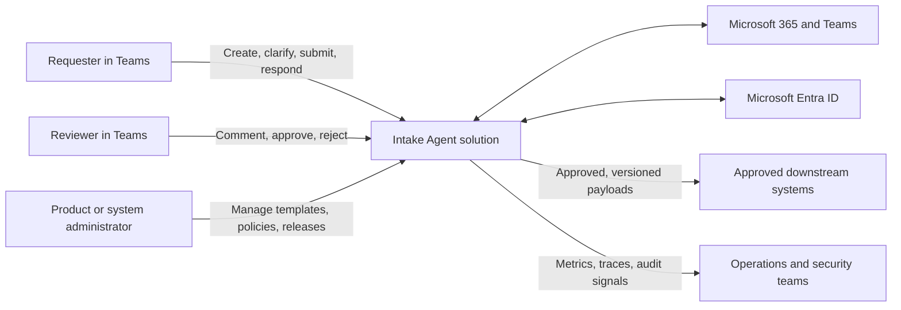

## 6. Logical container architecture

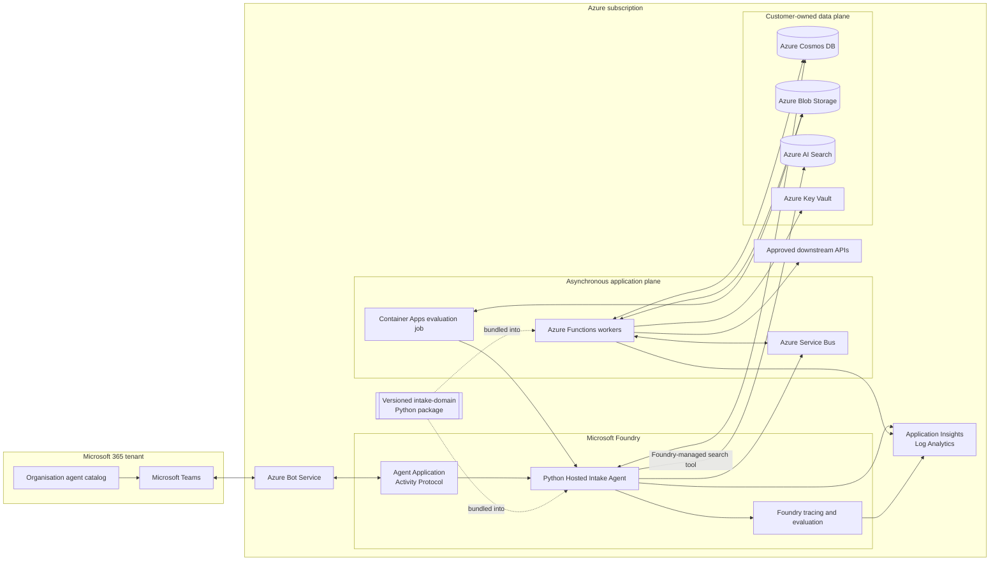

## 7. Component responsibilities

### 7.1 Teams channel and Foundry publishing

Foundry publishes the agent's stable endpoint to Teams and Microsoft 365:

- Creates or associates an Azure Bot Service resource.
- Generates the Teams application manifest.
- Enables the Activity Protocol.
- Configures tenant authorization for organisation-wide use.
- Submits the agent to the organisation catalog for Microsoft 365 administrator approval.

Production uses a pinned, approved agent version. `Always use latest` is acceptable only in development.

For a pilot, Foundry can publish the generated manifest directly. For production, use Foundry's **Download and customize** path so the same Foundry-generated application package can declare the Entra application information, notification activity types, deep links, and resource-specific consent required by the notification design. The customized package is submitted through the organisation's normal Teams application approval process; it does not add a custom bot host.

No custom Teams bot service is included in the MVP. A custom channel adapter is added only if a spike proves that required Adaptive Card actions, proactive notifications, attachments, or accessibility behavior cannot be delivered through native Foundry publishing.

### 7.2 Python Hosted Intake Agent

The Hosted Agent:

- Interprets user messages.
- Identifies candidate values and their source spans.
- Requests the active request state and allowed actions.
- Submits candidate values to internal typed command handlers.
- Explains deterministic validation results in user-friendly language.
- Generates focused clarification questions from confirmed gaps.
- Summarizes a revision for user review.
- Invokes review and workflow commands only when the deterministic domain layer reports them as allowed.

The Hosted Agent does not:

- Grant permissions.
- Decide whether a user is a reviewer.
- Directly change lifecycle state.
- Directly approve or reject a request.
- Supply identity context or call repositories from model-generated code.
- Treat generated confidence as authoritative.
- Execute arbitrary URLs, code, SQL, or unregistered MCP tools.

On every conversation turn, before interpreting the next action, the orchestration layer invokes `get_request_context`. The persisted request aggregate is always authoritative; Foundry conversation state is ephemeral transcript context and is never used as the source of truth for fields, lifecycle, permissions, or the current revision. This rehydration rule resolves divergence after retries, session loss, or partial platform failure.

The Hosted Agent's channel adapter extracts user and tenant identifiers from authenticated Activity metadata and creates an immutable request context outside the model-controlled argument payload. Internal command handlers accept actor context only from this adapter. They never trust a user ID generated or supplied by the model. If the selected downstream resource requires delegated user authorization, the adapter acquires an On-Behalf-Of token and the integration validates it. Confirming the exact Activity claims and OBO support is a production architecture gate and an early technical spike.

Every invocation carries:

- Verified Entra user and tenant identifiers from channel metadata.
- Foundry agent identity.
- Request ID and request revision.
- Teams activity and conversation identifiers.
- Correlation and idempotency identifiers.
- Agent, prompt, model, tool, template, and schema versions.

### 7.3 Hosted Agent internal architecture

The Hosted Agent is one deployment unit with explicit internal boundaries:

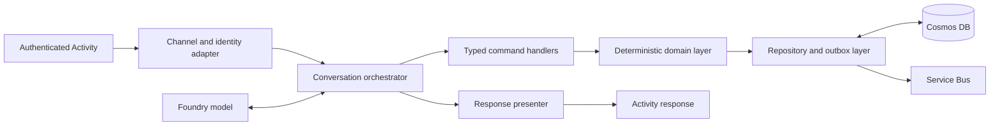

The application and domain layers:

- Template and schema version management.
- Request creation, retrieval, autosave, and resume.
- Field-level validation and source attribution.
- Deterministic completeness and contradiction rules.
- Confidence policy and low-confidence escalation.
- Clarification count and stop conditions.
- Lifecycle state-machine enforcement.
- Request-level and action-level authorization.
- Optimistic concurrency and immutable revision creation.
- Review comments, decisions, and rationale.
- Audit event creation.
- Outbox event creation in the same logical update as domain state.
- Idempotency for all mutating commands.

Combining these layers with the Hosted Agent removes an HTTP hop, a deployment, and a second runtime identity. Safety is preserved through code-level dependency direction: the model-facing orchestrator can invoke typed command handlers, but it cannot obtain repository instances, credentials, or mutable identity context. Domain and repository modules remain independently unit- and component-testable.

Extract these modules into a separate service only when another channel or API needs the same commands, domain and agent scaling differ materially, releases require independent cadence, or compliance requires a separate process or network trust boundary.

#### Package and dependency boundaries

The repository produces a private, versioned `intake-domain` Python package. The Hosted Agent and state-changing workers bundle the same approved package version:

```text
intake-channel       -> intake-application
intake-application   -> intake-domain
intake-persistence   -> intake-domain
intake-workers       -> intake-application + intake-persistence
intake-domain        -> Python standard library and domain-only dependencies
```

Dependencies point inward. Channel/orchestration modules cannot import persistence modules. CI uses import-boundary tests, such as `import-linter` contracts, to fail builds when the model-facing layer imports repositories, Azure SDK clients, credential providers, or mutable identity implementations.

The package is built once per release and promoted with the Hosted Agent and workers. Release evidence records its version. It contains no Foundry-specific types in its domain layer, preserving extraction into a future service.

### 7.4 Internal command facade

The model-facing orchestrator receives a small command set rather than repository or database access.

| Tool | Purpose | Mutating |
|---|---|---|
| `get_or_create_request` | Resolve a Teams conversation to an authorised request; uses a deterministic tenant/conversation key | Yes |
| `get_request_context` | Return current revision, template, gaps, and allowed actions | No |
| `propose_field_updates` | Validate and persist candidate values with source and confidence | Yes |
| `submit_for_review` | Validate completeness and request an allowed transition | Yes |
| `record_review_feedback` | Store reviewer comments against a revision | Yes |
| `record_review_decision` | Approve or reject an immutable revision | Yes |
| `request_document_generation` | Queue generation for an approved revision | Yes |
| `get_request_status` | Return lifecycle and work-item status | No |

Command schemas reject unknown properties and enforce bounded payload sizes. Results distinguish validation failures, authorization failures, conflicts, transient failures, and permanent failures. The model-facing layer may rephrase an error but may not convert failure into success.

`get_or_create_request` uses a deterministic document identifier derived from tenant ID and Teams conversation ID and a conditional create. Concurrent first messages therefore resolve to one request rather than creating duplicate drafts.

An Azure Functions MCP endpoint can expose future cross-agent or shared enterprise tools. Domain request commands remain private Python interfaces unless MCP demonstrably improves governance without widening access.

Service-only commands are not exposed to the model:

| Command | Allowed workload | Effect |
|---|---|---|
| `record_artifact_result` | Document worker | Records a generated artifact or explicit failure against the approved revision |
| `record_delivery_result` | Integration worker | Records delivery success, retryable failure, or permanent failure |
| `complete_request_if_ready` | Completion worker | Transitions `Approved` to `Completed` only when required artifacts and mandatory handoffs satisfy policy |
| `record_notification_result` | Notification worker | Records notification delivery and exhausted retry status |

Workers execute these commands through the bundled `intake-domain` package with immutable service actor context derived from their managed identity. They do not patch request state directly.

### 7.5 Asynchronous workers

| Worker | Responsibility |
|---|---|
| Outbox dispatcher | Publishes committed domain events to Service Bus and marks them delivered |
| Notification worker | Sends actionable Teams notifications through an approved mechanism |
| Document worker | Generates Word/PDF output, validates it, stores it, and records metadata/checksum |
| Integration worker | Delivers approved versioned payloads with idempotency and contract validation |
| Completion worker | Applies completion policy after artifact and mandatory delivery events |
| Evaluation job | Executes benchmark suites, produces a signed scorecard, and records release metrics |
| Retention worker | Applies deletion, retention, and legal-hold policies across all stores |

Workers use bounded retries. Permanent failures and exhausted retries move to a dead-letter queue with an operator-visible recovery action.

The notification worker uses the Microsoft Graph Teams activity-feed notification API as the primary out-of-session reminder. The customized Teams manifest includes `webApplicationInfo`, declares the required activity types, and requests the narrow `TeamsActivity.Send.User` resource-specific consent permission. Notifications deep-link to the agent or request context. A dedicated Entra application identity sends notifications using app-only authentication without a stored client secret. Hardened egress permits the required `graph.microsoft.com` endpoints. If delivery exhausts retries, the event is dead-lettered, operators are alerted, and reviewers still see an authoritative pending-review list when they next open the agent. In-conversation responses continue through the native Foundry Activity Protocol.

The retention worker invokes supported Foundry conversation/thread deletion operations and records verification without retaining deleted content. Exact APIs, configurable retention, and deletion semantics must be validated against the selected Foundry API version. If policy-required deletion cannot be executed and evidenced across Foundry conversation state, production launch is blocked.

## 8. Data architecture

### 8.1 Domain model

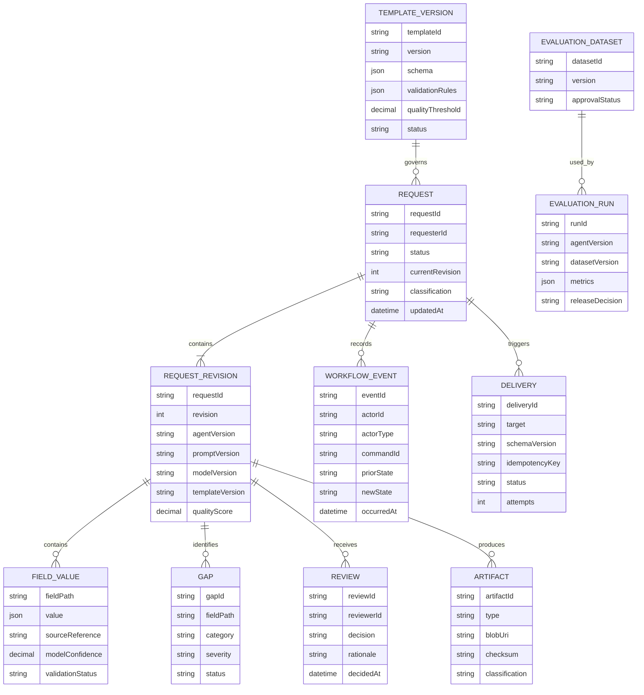

### 8.2 Cosmos DB design

Business data uses customer-owned Cosmos DB for NoSQL.

| Container | Partition key | Contents |
|---|---|---|
| `requests` | `/requestId` | Request projection, revisions, fields, gaps, reviews, workflow events, and outbox items |
| `templates` | `/templateId` | Immutable versions and active-version metadata |
| `deliveries` | `/requestId` | Downstream delivery attempts and status |
| `evaluations` | `/datasetId` | Dataset metadata, run metadata, metrics, and release decisions |
| `idempotency` | `/scopeId` | Command keys and replay-safe results; default TTL is 7 days for interactive commands and 30 days for asynchronous deliveries |

Request-owned records share `requestId` so reads and transactional batches stay within one logical partition. Current projections use ETags. Workflow events and approved revisions are immutable.

Foundry standard setup also provisions Foundry-owned container structures inside the customer Cosmos DB account for conversations and run state. Product code must not depend on their internal schema.

The idempotency TTL must always exceed the longest configured retry, lock renewal, scheduled redelivery, and approved operator replay window. Resilience tests verify command replay immediately before and after the configured boundary. Foundry containers and product containers receive separate capacity budgets and alerts so platform conversation traffic cannot exhaust the request system's provisioned throughput.

### 8.3 Blob Storage design

Blob containers:

- `request-artifacts`: generated Word/PDF files.
- `quarantine`: failed or unsafe uploads pending review.

Approved artifacts use immutable/versioned storage where policy permits. Blob metadata includes request ID, revision, classification, schema version, checksum, retention category, and generation version. Users receive short-lived, authorised access rather than public URLs.

Evaluation datasets and evidence use a separate non-production storage account, separate encryption scope, separate Entra groups, and a retention policy independent of request artifacts. Production managed identities cannot read benchmark expected results. Approved evaluation jobs receive time-bound access to the required dataset version.

### 8.4 Search and grounding

Azure AI Search is used only for approved enterprise knowledge:

- Template guidance.
- Policy definitions.
- Controlled examples.
- Domain glossaries.

Retrieved content is treated as untrusted data, not system instruction. Every grounded answer records source identifiers. Request business state is read through the Hosted Agent's domain repositories, not reconstructed from vector search.

Search is exposed through a Foundry-managed Azure AI Search tool, not the internal command facade. The dedicated agent identity receives read-only Search Index Data Reader access only to approved indexes. Search has no write or administrative permission and cannot access request business-state containers.

## 9. Lifecycle and concurrency

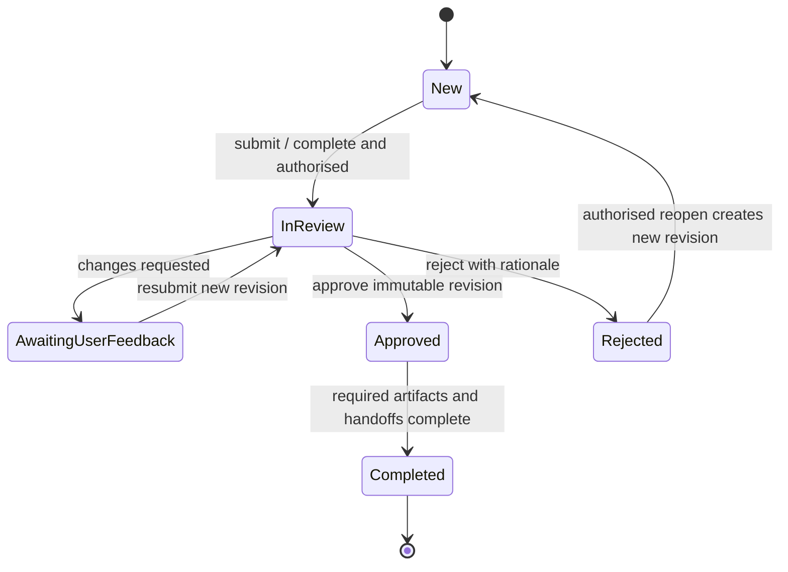

Rules:

- `New` includes editable draft behavior.
- Every mutating command includes an expected revision or ETag.
- A conflict returns the latest revision and never silently overwrites another edit.
- Approval records the exact immutable revision.
- Changes after approval require a new revision and review cycle.
- Reopening a rejected request is explicit and audited.
- A completed request is not edited; follow-up work creates a related request.

### 9.1 State-transition authorization matrix

| From | Command | To | Allowed actor | Required conditions |
|---|---|---|---|---|
| None | Create | New | Authenticated requester | No active draft already mapped to the conversation unless explicitly creating another |
| New | Submit | In Review | Request owner or authorised administrator | Mandatory fields complete; quality threshold met; expected revision matches |
| In Review | Request changes | Awaiting User Feedback | Assigned reviewer or authorised administrator | Comment/rationale supplied; expected revision matches |
| Awaiting User Feedback | Resubmit | In Review | Request owner or authorised administrator | New immutable revision created; mandatory fields complete |
| In Review | Approve | Approved | Assigned reviewer or authorised administrator | Reviewer is not disallowed by separation-of-duties policy; rationale captured |
| In Review | Reject | Rejected | Assigned reviewer or authorised administrator | Rationale captured |
| Approved | Complete | Completed | Completion worker or authorised administrator | Required artifacts and enabled mandatory handoffs succeeded |
| Rejected | Reopen | New | Request owner or authorised administrator | New revision created and reopen rationale recorded |

Any unlisted transition is denied. The deterministic domain layer enforces this matrix; the model-facing orchestrator only presents actions returned by `get_request_context`.

## 10. Key interaction flows

### 10.1 Capture and clarification

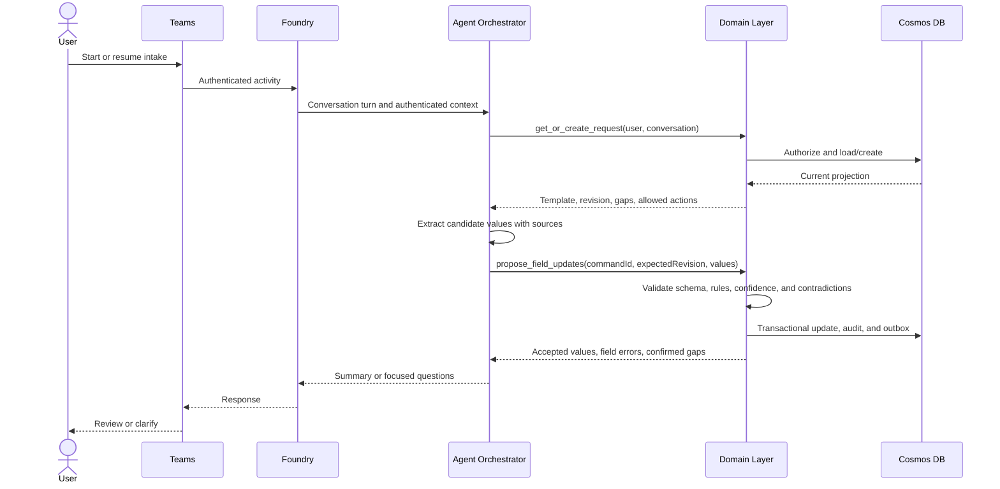

### 10.2 Review and approval

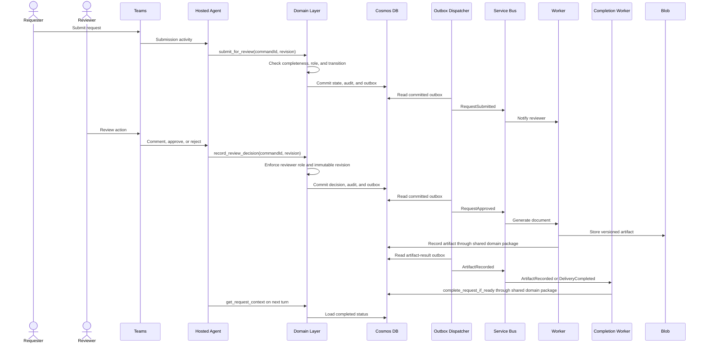

### 10.3 Downstream delivery

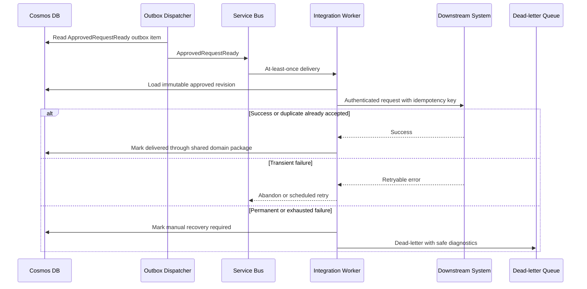

## 11. Command and event boundaries

### 11.1 Internal command conventions

- Typed Python command and result models.
- `commandId` required for mutating commands.
- Explicit `expectedRevision` required for concurrent updates.
- Stable error codes and structured failure results.
- Maximum request and field sizes enforced before model or persistence processing.
- User identity and agent identity are both recorded when the agent acts on behalf of a user.
- Repository and identity-context dependencies are constructed outside model-controlled code and injected only into command handlers.

Representative command handlers:

```python
get_or_create_request(context, command)
get_request_context(context, query)
propose_field_updates(context, command)
submit_for_review(context, command)
request_changes(context, command)
approve_request(context, command)
reject_request(context, command)
request_document_generation(context, command)
```

### 11.2 Domain events

Events use an envelope containing `eventId`, `eventType`, `eventVersion`, `requestId`, `revision`, `correlationId`, `causationId`, `occurredAt`, `actor`, and `data`.

Initial event types:

- `RequestCreated`
- `RequestFieldsUpdated`
- `ClarificationRequired`
- `RequestSubmitted`
- `ReviewFeedbackAdded`
- `RequestApproved`
- `RequestRejected`
- `DocumentGenerationRequested`
- `DocumentGenerated`
- `DeliveryRequested`
- `DeliveryCompleted`
- `DeliveryFailed`
- `RequestCompleted`
- `RetentionDeletionRequested`

Consumers ignore unknown additive fields, reject unsupported major event versions, and deduplicate by `eventId`.

## 12. Identity and authorization

### 12.1 Identity types

| Actor | Identity | Use |
|---|---|---|
| Teams user | Microsoft Entra user identity | Interactive request and review actions |
| Hosted Intake Agent | Dedicated Foundry agent identity | Cosmos DB, Service Bus, Azure AI Search, monitoring, and attributable actions |
| Document worker | Dedicated managed identity | Consume document jobs, write artifacts, and invoke artifact-result commands |
| Notification worker | Dedicated Entra application and workload identity | Consume notification jobs and call Microsoft Graph with approved RSC |
| Integration worker | Dedicated managed identity per integration trust boundary | Consume deliveries, call approved target, and invoke delivery-result commands |
| Completion worker | Dedicated managed identity | Evaluate completion policy and invoke `complete_request_if_ready` |
| Evaluation job | Dedicated managed identity | Read approved benchmark version, invoke the test agent, and write evaluation evidence |
| Retention worker | Dedicated managed identity | Apply approved deletion and legal-hold policy across in-scope stores |
| CI/CD | Workload identity federation | Infrastructure and application deployment without stored client secrets |

The interactive pattern is used for user-driven actions. On-Behalf-Of is used only when a downstream resource must apply the user's delegated permissions. System-wide background work uses a dedicated workload identity with narrowly scoped application permissions.

For commands, two independently protected actor values are recorded: the authenticated Foundry agent identity is the workload, and the verified Teams/Entra user from channel metadata is the represented user. Model-generated arguments cannot set or override either value. The identity-propagation spike must prove this behavior before requester or reviewer authorization is enabled.

### 12.2 Least-privilege resource access

| Identity | Minimum data-plane access |
|---|---|
| Hosted Agent | Cosmos DB Built-in Data Contributor scoped to product databases/containers; Service Bus Data Sender scoped to the domain-event entity; Search Index Data Reader on the approved search service; monitoring ingestion |
| Outbox dispatcher | Read/update product outbox records and Service Bus Data Sender |
| Document worker | Service Bus Data Receiver, Blob Data Contributor on request artifacts, and product-container access required by service-only commands |
| Notification worker | Service Bus Data Receiver and approved Microsoft Graph `TeamsActivity.Send.User` RSC |
| Integration worker | Service Bus Data Receiver, product delivery-container access, and target-specific credentials or delegated role |
| Evaluation job | Read-only benchmark storage, write-only evidence path where practical, and permission to invoke the test Agent Application |
| Retention worker | Delete access only to stores covered by the approved retention workflow |

The Hosted Agent has no access to Foundry-owned Cosmos DB containers, no Service Bus receiver role, and no Key Vault secret access by default. Exceptional non-Entra credentials belong to the specific worker that needs them and are read from Key Vault under a separate identity.

### 12.3 Role model

| Action | Requester | Reviewer | Administrator | Service |
|---|---:|---:|---:|---:|
| Create request | Yes | Yes | Yes | No |
| View owned request | Yes | Policy | Yes | Scoped |
| Edit draft/feedback revision | Owner | No | Exceptional | No |
| Submit for review | Owner | No | Exceptional | No |
| Comment on review | No | Assigned | Yes | No |
| Approve/reject | No | Assigned | Policy | No |
| Manage templates | No | No | Yes | No |
| Generate approved artifact | Request | Request | Yes | Worker |
| Deliver downstream | No | No | Configure | Worker |
| View restricted telemetry | No | No | Policy | Operator |

Entra groups or app roles provide coarse roles. The Hosted Agent's deterministic authorization module combines those claims with ownership, assignment, classification, current state, and action for the final decision.

## 13. Security and privacy

### 13.1 Threat controls

| Threat | Controls |
|---|---|
| Direct prompt injection | System/user content separation, constrained tools, schema validation, allow-listed actions, Foundry guardrails |
| Indirect prompt injection from retrieved content | Treat retrieval as data, source allow-list, content filters, no instruction authority, output validation |
| Excessive agency | No generic execution tools, least-privilege identities, command authorization in Core, approval for consequential actions |
| Data disclosure | Request-level authorization, classification, redaction, private endpoints, no public blobs, bounded tool responses |
| Tampering | ETags, immutable revisions, checksums, audit events, signed deployment artifacts |
| Replay and duplication | Idempotency keys, event IDs, Service Bus duplicate handling, consumer deduplication |
| Secret exposure | Managed identities, workload federation, Key Vault, secret scanning, no secrets in prompts or manifests |
| Poisoned evaluation data | Dataset approvals, separation from development examples, provenance, access control, versioning |
| Unsafe model change | Pinned versions, evaluation gate, staged rollout, rollback |

### 13.2 Data lifecycle

- Classify fields before launch and apply policy by classification.
- Encrypt in transit and at rest; use customer-managed keys if governance requires them.
- Redact sensitive values from logs, metrics dimensions, queue diagnostics, and evaluation exports.
- Keep production requests out of benchmark datasets unless approved, minimized, and redacted.
- Apply retention consistently across Cosmos DB, Foundry conversation state, Blob Storage, Search indexes, telemetry, backups, and dead-letter messages.
- A deletion workflow records scope and completion without retaining deleted content.
- Legal hold overrides routine deletion through an explicit, audited policy.
- Block production launch until Foundry conversation-state expiry/deletion can be configured, invoked, and evidenced to satisfy the approved policy.

## 14. Deployment architecture

### 14.1 Environment isolation

Development, test, and production use separate Foundry projects and separate application/data resources. Production should use a separate subscription where enterprise policy requires a stronger trust boundary.

Resource naming, tags, diagnostics, RBAC, budgets, locks, and policies are deployed with Bicep. GitHub Actions uses workload identity federation.

### 14.2 Baseline enterprise variant

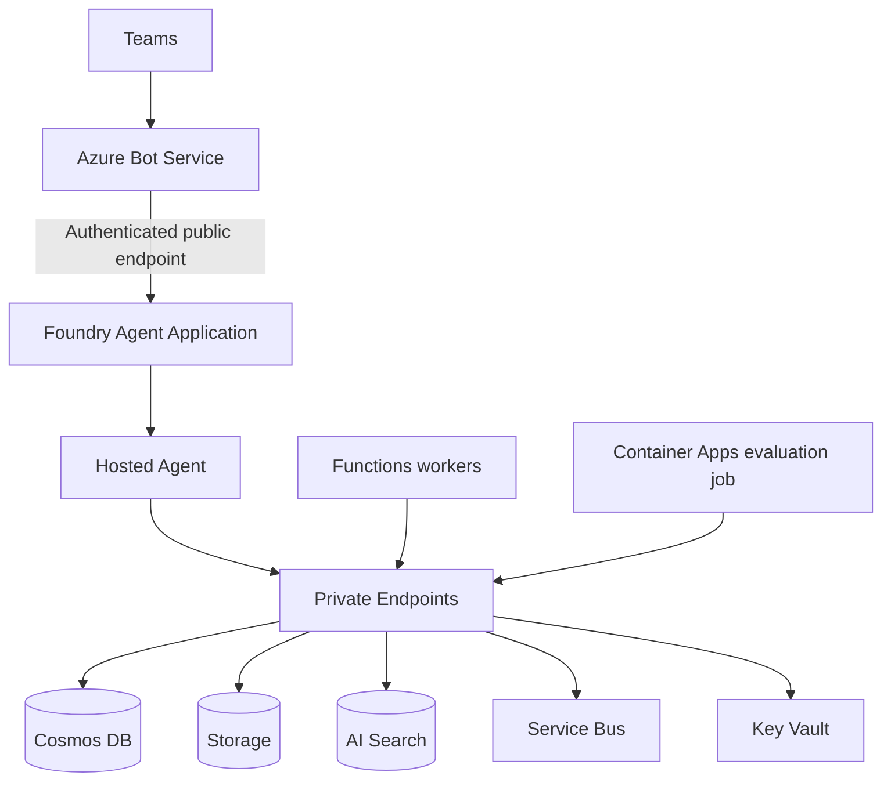

Characteristics:

- Foundry ingress remains public but requires Microsoft Entra and tenant authorization.
- Customer-owned data services use private endpoints and public network access disabled where supported.
- The Hosted Agent uses its dedicated identity for data and messaging access; no second application ingress is exposed.
- Native Foundry portal publishing is available for pilots; production downloads and customizes the generated manifest for notifications and enterprise app policy.
- This is the preferred pilot topology when compliance permits.

### 14.3 Hardened private variant

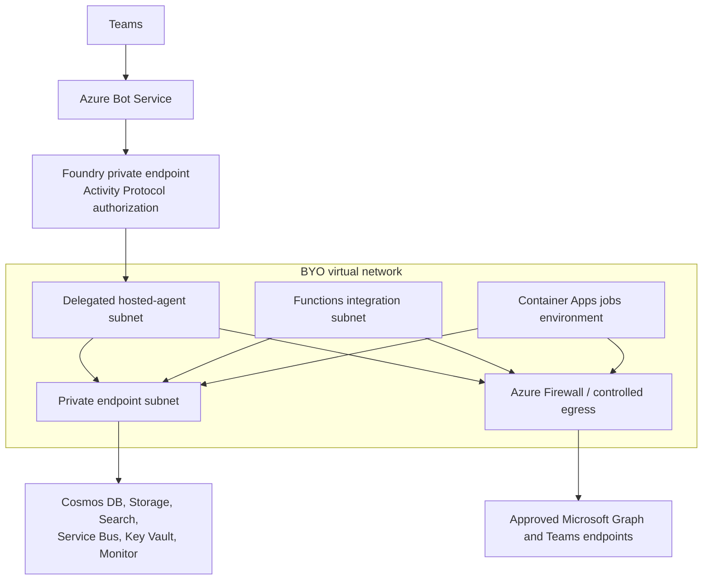

Characteristics:

- The Foundry account is created with BYO VNet networking and public access disabled.
- Use a dedicated delegated subnet. Start production sizing at `/24` for Hosted Agent session concurrency and rolling revision headroom; confirm with load estimates.
- Private DNS zones resolve Foundry and customer-owned services inside the network.
- Controlled egress permits only approved destinations.
- The egress allow-list includes the Microsoft Graph and Teams endpoints required for activity-feed notifications and publishing operations.
- Teams publishing uses the documented Foundry REST flow because portal publishing is unavailable when public access is disabled.
- Every selected Foundry tool must be checked for private-network support.
- Network injection cannot be retrofitted to an existing Foundry account; this decision is made before environment creation.

### 14.4 API Management

API Management is not placed between Teams and Foundry. It is optional for:

- External or cross-trust-boundary downstream APIs.
- Partner-facing future APIs.
- Centralized contract policy, quota, transformation, or mTLS requirements.

There is no internal service network call in the modular-monolith design. API Management becomes relevant only if the domain boundary is later extracted or an external API is introduced.

## 15. Reliability and recovery

- Persist each accepted field update before reporting success.
- Use Cosmos DB transactional batches for request projection, audit event, and outbox item within a request partition.
- Dispatch outbox records asynchronously and safely retry publication.
- Configure Service Bus dead-letter alerts and operator replay tooling.
- Apply bounded exponential backoff with jitter; never retry authorization or validation failures.
- Generate artifacts from immutable revisions so retries are reproducible.
- Use deterministic artifact names and checksums to suppress duplicates.
- Keep previous Hosted Agent and application versions available for rollback.
- Promote the same `intake-domain` package version with the Hosted Agent and state-changing workers; reject mixed versions unless an explicitly tested compatibility window exists.
- Back up configuration, templates, policies, and infrastructure definitions in source control.
- Validate Cosmos DB continuous backup/point-in-time restore and Storage recovery settings against RPO/RTO.
- Test restore and regional recovery procedures at an agreed cadence.

## 16. Observability

### 16.1 Correlation

Propagate:

- `traceId`
- `correlationId`
- `requestId`
- `requestRevision`
- `commandId`
- `eventId`
- Teams `activityId` and conversation reference
- Foundry session/conversation and agent version

Sensitive content is excluded from standard logs. Restricted model traces use separate access and retention controls.

### 16.2 Signals

| Category | Measures |
|---|---|
| Experience | Completion, abandonment, clarification turns, time to complete, review cycle time |
| Quality | Capture accuracy, gap recall, false-positive gaps, contradiction detection, groundedness, reviewer acceptance |
| Agent | Model latency, token usage, tool calls, tool failures, guardrail events, prompt-injection detections |
| Application | Command latency, errors, conflicts, authorization denials, state-transition failures |
| Async | Queue depth, oldest message, retries, dead letters, document and delivery status |
| Platform | Foundry Hosted Agents, Functions, Cosmos DB, Storage, Search, and Service Bus health/capacity |
| Cost | Model/token cost, Hosted Agent compute, Cosmos RU consumption, Search units, storage, and egress |

Alerts have an owner, threshold, severity, runbook, and escalation route.

## 17. Evaluation and testing architecture

### 17.1 Evaluation pipeline

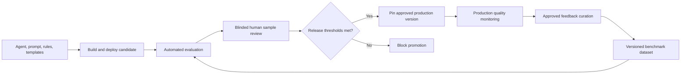

Evaluation records agent, model, prompt, tool, policy, template, schema, and dataset versions.

Release evaluation runs as a private Azure Container Apps Job with a unique `runId`. GitHub Actions starts the job, polls the authenticated evaluation-status endpoint for up to 60 minutes, and fails closed on timeout, job failure, missing metrics, or a non-passing `releaseDecision`. The job writes a machine-readable signed JSON scorecard and human-readable report to the evaluation evidence account. GitHub Actions retains the scorecard as release evidence. Scheduled production-quality checks may use the same job asynchronously but do not replace the release gate.

Metrics include:

- Field capture exact and semantic accuracy.
- Required-gap recall.
- False-positive gap rate.
- Contradiction precision and recall.
- Clarification relevance and repetition.
- Groundedness and unsupported-field rate.
- Completion rate and clarification burden.
- Reviewer acceptance and override rate.
- Critical privacy, authorization, prompt-injection, and unsafe-action failures.

Thresholds are set after a documented baseline. A critical security or data-integrity failure always blocks release.

### 17.2 Test layers

| Layer | Coverage |
|---|---|
| Unit | Validators, quality formula, state transitions, authorization policies, mapping, idempotency |
| Component | Hosted Agent command/domain/repository modules with emulated or isolated data dependencies |
| Contract | Internal command schemas, events, downstream payloads, document schemas |
| Integration | Cosmos DB, Blob, Service Bus, Key Vault, Foundry tools, Graph/Teams notification path |
| End to end | Teams intake, resume, clarification, submit, review, feedback, approve, document, completion |
| AI regression | Benchmark and adversarial cases over repeated runs where necessary |
| Security | Identity, authorization, tenant isolation, injection, disclosure, dependency and container scanning |
| Resilience | Timeouts, duplicate delivery, concurrency conflict, dependency outage, poison messages, restore |
| Performance | Concurrent sessions, command latency, queue throughput, Cosmos RU, document generation |
| Accessibility | Keyboard, screen-reader semantics, contrast, focus, card actions, actionable errors |

## 18. CI/CD and release

```mermaid
flowchart LR
    PR[Pull request] --> Static[Lint, type, unit, security scans]
    Static --> Build[Build agent and services]
    Build --> DeployTest[Deploy test environment]
    DeployTest --> Tests[Integration, contract, E2E]
    Tests --> Eval[Start evaluation job and wait for signed scorecard]
    Eval --> Approval[Release approval]
    Approval --> Prod[Deploy services and pin agent version]
    Prod --> Smoke[Teams smoke test and telemetry check]
    Smoke --> Complete[Release evidence retained]
```

Release artifacts:

- Bicep deployment and parameter versions.
- Python package/container digests and SBOM.
- Agent, prompt, tool, and model versions.
- Template and schema versions.
- Automated test results.
- Evaluation scorecard and human review.
- Security and accessibility evidence.
- Migration, rollback, and runbook references.

Risky changes use staged rollout or a feature flag. Production never automatically selects the latest agent version.

## 19. Backlog traceability

| Backlog epic | Primary architecture components and controls |
|---|---|
| 1. Structured Requirements Capture | Hosted Agent, TemplateVersion, deterministic validation modules, request revisions, source attribution |
| 2. Gap Analysis & Clarification | Agent clarification logic, deterministic gap rules, quality thresholds, clarification limits, evaluation metrics |
| 3. Output Generation | Document worker, immutable approved revision, Blob artifacts, checksums, accessible templates |
| 4. Persistence & Workflow | Cosmos DB, lifecycle state machine, ETags, autosave, audit events, outbox |
| 5. Human-in-the-Loop Review | Entra reviewer roles, assigned review, Teams actions, immutable decisions, feedback traceability |
| 6. Downstream Automation | Service Bus, integration worker, versioned contracts, managed identity, idempotency, DLQ |
| 7. Evaluation & Quality | Benchmark storage, evaluation worker, Foundry evaluation/tracing, scorecards, release gate |
| 8. Testing & QA | Layered automated tests, Teams E2E, adversarial tests, CI gates |
| 9. Security, Privacy & Governance | Entra, agent identity, managed identity, Key Vault, private endpoints, retention, provenance |
| 10. Reliability, Observability & Operations | Outbox, queues, retries, telemetry, dashboards, runbooks, rollback, restore |
| 11. Experience & Accessibility | Teams-native UX, save/resume, clear errors, Adaptive Card validation, usability and WCAG testing |

## 20. Delivery slices

### Slice 1: Foundation

- Bicep modules and environment structure.
- Foundry development project and Python Hosted Agent skeleton.
- Customer-owned Cosmos DB, Storage, Search, Key Vault, monitoring, and managed identities.
- Entra groups/app roles.
- GitHub Actions CI and workload identity federation.

### Slice 2: Vertical intake path

- Native Teams publishing for an individual pilot.
- Template loading and request creation.
- Candidate extraction, deterministic validation, autosave, and resume.
- Foundry and application trace correlation.
- Initial unit, contract, integration, and Teams smoke tests.

### Slice 3: Clarification and evaluation

- Gap and contradiction rules.
- Confidence semantics and clarification limits.
- Versioned benchmark dataset.
- Automated evaluation and scorecard.
- Quality dashboards and release threshold baseline.

### Slice 4: Review and documents

- State machine and optimistic concurrency.
- Reviewer assignment and authorization.
- Feedback, resubmission, approval, and rejection.
- Document generation, Blob access, and notification path.
- End-to-end accessibility and usability validation.

### Slice 5: Production hardening

- Final baseline or hardened network topology.
- Data retention/deletion and backup/restore.
- Threat modeling, security and resilience tests.
- Production monitoring, alerts, runbooks, staged rollout, and rollback.
- Tenant-wide Microsoft 365 administrator approval.

### Slice 6: Downstream automation

- Versioned output contracts.
- Integration identities and optional API Management.
- Service Bus delivery, retries, idempotency, DLQ, and replay.
- Agent-to-agent endpoint only after its protocol and security design is approved.

## 21. Architecture decisions

| ID | Decision | Status |
|---|---|---|
| ADR-001 | Use native Foundry publishing to Teams; do not build a custom bot host for MVP | Accepted |
| ADR-002 | Use a Python Hosted Agent rather than a prompt-only agent | Accepted |
| ADR-003 | Deploy orchestration and deterministic core modules together as a Hosted Agent modular monolith | Accepted |
| ADR-004 | Use Foundry standard setup with customer-owned data resources | Accepted |
| ADR-005 | Use Cosmos DB request partitions, optimistic concurrency, audit events, and an outbox | Proposed |
| ADR-006 | Use Service Bus and Functions for asynchronous work | Proposed |
| ADR-007 | Pin approved production agent versions | Accepted |
| ADR-008 | Support baseline and hardened deployment variants until compliance selects one | Accepted |
| ADR-009 | Extract a Core service only for additional consumers, materially different scaling/release needs, or a required process trust boundary | Accepted |
| ADR-010 | Build the deterministic core as a private `intake-domain` package bundled into the Hosted Agent and state-changing workers | Accepted |

## 22. Risks and mitigations

| Risk | Impact | Mitigation |
|---|---|---|
| Native Foundry Teams publishing lacks a required interaction | Custom channel work delays MVP | Run an early spike for cards, attachments, authenticated Activity claims, SSO/OBO, and accessibility; use Graph activity-feed notifications for out-of-session reminders |
| Activity Protocol is the only active protocol on an Agent Application | Future API consumers cannot use the same endpoint through Responses | Publish a separate Agent Application endpoint for API consumers if required |
| Foundry network choice cannot be retrofitted | Rebuild required to move from baseline to hardened | Decide production topology before production Foundry account creation; keep IaC portable |
| Hosted Agent subnet exhaustion | Sessions or rolling deployments fail | Capacity model concurrency and revisions; begin hardened production design at `/24` |
| Model output changes across versions | Quality regression | Pin versions, run benchmark evaluation, stage rollout, retain rollback version |
| Conversation state diverges from business state | Incorrect resume or decisions | Treat the persisted request aggregate as source of truth and reload it on every turn |
| Combined Hosted Agent becomes tightly coupled | Harder future extraction or testing | Enforce orchestration, command, domain, and repository module boundaries and prevent inward dependencies on Foundry types |
| Hosted Agent and workers use different domain versions | State invariants or event schemas diverge | Build once, promote package versions together, record versions in telemetry, and test any compatibility window |
| Teams/Microsoft 365 processing conflicts with residency policy | Compliance block | Complete data-flow and governance review before tenant-wide publishing |
| Sensitive data enters traces or evaluation data | Privacy incident | Default redaction, restricted traces, dataset approval, automated scanning |
| Review notifications cannot be sent reliably | Slow workflow | Validate Graph activity-feed notifications early; provide an in-agent pending-review list, retries, dead-letter alerting, and operator recovery |
| Cosmos DB standard setup capacity is underestimated | Provisioning or runtime failure | Include Foundry container RU requirements and product workload in capacity planning |

## 23. Open decisions and validation spikes

1. Confirm the final production network variant with security and compliance.
2. Select the model and Azure region after checking Foundry Hosted Agent, tool, data-residency, and quota support.
3. Validate native Teams support for Adaptive Cards, file handling, deep links, and required accessibility behavior.
4. Prove that authenticated Activity claims are injected outside model-controlled arguments and determine whether any operation requires On-Behalf-Of.
5. Decide whether Word/PDF generation runs in Functions or a Container Apps job based on library/runtime constraints.
6. Define exact field confidence semantics and evaluation thresholds from a baseline dataset.
7. Confirm retention, legal hold, deletion, backup, and data-residency policy, including supported Foundry conversation-state deletion and evidence.
8. Estimate concurrency, message sizes, document sizes, Cosmos RU, queue throughput, and hardened subnet capacity.
9. Select the first downstream integration and define its contract, identity, timeout, and recovery behavior.
10. Confirm whether API Management is required by enterprise platform policy.

## 24. Microsoft platform references

The design was checked against current Microsoft documentation:

- [What is Microsoft Foundry Agent Service?](https://learn.microsoft.com/azure/foundry/agents/overview)
- [Publish agents to Microsoft 365 Copilot and Microsoft Teams](https://learn.microsoft.com/azure/foundry/agents/how-to/publish-copilot)
- [Networking options for Foundry Agent Service](https://learn.microsoft.com/azure/foundry/agents/concepts/networking-options)
- [Deep dive into Foundry Agent Service networking](https://learn.microsoft.com/azure/foundry/agents/concepts/agents-networking-deep-dive)
- [Use your own resources with Foundry Agent Service](https://learn.microsoft.com/azure/foundry/agents/how-to/use-your-own-resources)
- [What are hosted agents?](https://learn.microsoft.com/azure/foundry/agents/concepts/hosted-agents)
- [Plan your agent identity architecture](https://learn.microsoft.com/entra/agent-id/how-to-plan-agent-identity-architecture)
- [Send activity feed notifications to users in Microsoft Teams](https://learn.microsoft.com/graph/teams-send-activityfeednotifications)

Platform preview status, regional support, quotas, protocol limitations, and networking/tool compatibility must be rechecked before each environment is provisioned.
