# Intake Agent Solution Architecture

## 1. Executive summary

The Intake Agent is an internal enterprise application delivered through Microsoft Teams. It captures structured requirements, identifies gaps and contradictions, guides clarification, supports human review, preserves approved immutable revisions, and hands approved requests to downstream systems.

The solution uses Microsoft Foundry Agent Service to publish two first-class agent variants to Teams: a code-based Python Hosted Agent and a configuration-based Prompt Agent. They are interchangeable orchestration adapters over the same versioned tool contracts and deterministic intake platform. Foundry and Azure Bot Service handle the Teams channel; a separate custom bot host is not required for the MVP.

The central design rule is:

> The language model may interpret and propose, but deterministic code authorizes, validates, persists, and changes state.

Each agent variant interprets conversation, asks clarifying questions, and presents results, but neither owns authoritative state or business decisions. Teams identity metadata, Bot Service channel authentication, agent identity, Toolbox authentication, user-delegated MCP authorization, and command-service data access remain separate trust boundaries. Both variants use versioned requester and reviewer Toolbox configurations; the agent authenticates to Toolbox with its own identity, while each OAuth connection obtains a user credential through explicit consent before calling the private streamable-HTTP MCP endpoint. The shared Intake Command Service runs in a dedicated Intake Agent Container Apps managed environment and composes deterministic application/domain packages with Azure persistence adapters. Requester and reviewer contracts have separate scopes and tool allow-lists; worker commands remain private. Azure Cosmos DB stores request data, Azure Blob Storage stores evaluation datasets and evidence, Azure Service Bus decouples background work, and Azure Functions process notifications, retention, completion, and downstream deliveries.

## 2. Scope

### 2.1 In scope

- Microsoft Teams as the primary MVP channel.
- Single Microsoft Entra tenant and one enterprise organisation.
- Parallel Hosted Agent and Prompt Agent variants with equivalent business capabilities.
- Shared, versioned requester and reviewer MCP contracts that are independent of agent, model, and channel SDK types.
- Structured, versioned intake templates.
- Conversational data collection and clarification.
- Deterministic validation, gap detection support, and confidence handling.
- Request persistence, autosave, resume, lifecycle, and audit.
- Requester and reviewer workflows.
- Approved immutable structured revisions and versioned downstream handover.
- Evaluation, testing, observability, security, and release controls.
- Versioned downstream payloads and future agent-to-agent handover.
- Baseline and hardened Azure deployment variants.

### 2.2 Out of scope for MVP

- Public or multi-tenant SaaS access.
- Anonymous access.
- A standalone web user interface.
- Autonomous approval by the model.
- Unrestricted web browsing or arbitrary tool execution.
- Training a foundation model.
- Word or PDF generation from approved requests.
- Duplicating deterministic business logic or persistence adapters inside either agent variant.
- Downstream integrations that have not passed contract, security, privacy, and recovery review.

## 3. Drivers and quality attributes

| Driver | Architectural response |
|---|---|
| Enterprise Teams experience | Publish each approved Foundry agent variant natively to Teams using the Activity Protocol |
| Agent portability | Treat Hosted and Prompt Agents as adapters over shared, versioned Toolbox/MCP contracts and persisted business state |
| Correct workflow behavior | Keep lifecycle, authorization, validation, persistence, and identity derivation in the deterministic Intake Command Service rather than either agent |
| Auditability | Record user, agent, model, prompt, template, revision, command, and decision provenance |
| Data ownership | Use Foundry standard setup with customer-owned Cosmos DB, Storage, and Azure AI Search |
| Security and privacy | Entra identities, managed identity, least privilege, private data endpoints, redaction, retention, and deletion workflows |
| AI quality | Versioned benchmark data, automated evaluation, human scoring, and promotion gates |
| Recoverability | Autosave each accepted change; use idempotent commands, an outbox, queues, retries, and dead-letter recovery |
| Evolvability | Version templates, schemas, shared behavior specifications, variant instructions, agents, tools, APIs, and downstream contracts independently |
| Operational visibility | Correlate Teams activities, Foundry traces, domain commands, queue work, deliveries, and evaluation evidence by request or run ID |
| Accessibility | Prefer Teams-native interactions and test supported flows against WCAG 2.2 AA |

### 3.1 Provisional service objectives

These are initial architecture targets and must be confirmed by product owners after baseline and load testing.

| Measure | Initial target |
|---|---|
| User-facing service availability | 99.9% monthly, excluding declared Microsoft 365 and Foundry platform outages |
| Persisted command latency | 95th percentile under 2 seconds, excluding model inference |
| Agent response latency | 95th percentile under 15 seconds for normal clarification turns |
| Autosave durability | Accepted field updates persisted before success is shown |
| Recovery point objective | 5 minutes |
| Recovery time objective | 4 hours |
| Audit event loss | Zero acknowledged state changes without a corresponding audit event |

## 4. Architecture principles

1. **Deterministic core, probabilistic edge.** Model output is untrusted input to domain rules.
2. **No direct model-to-database access.** The agent acts only through typed, allow-listed commands.
3. **Persist business state, not model memory.** A request resumes from the product data store even if a Foundry session is lost.
4. **Identity follows the action.** User-driven operations retain user context; background operations use explicit workload or agent identities.
5. **Immutable decisions and provenance.** Approved revisions and audit events are not overwritten.
6. **At-least-once delivery with idempotent consumers.** Queue redelivery must not duplicate business effects.
7. **Version every behavioral dependency.** Agent, prompt, model, template, schema, policy, tool, and benchmark versions are recorded.
8. **Private by design, observable by design.** Sensitive content is protected without removing the telemetry needed to operate the service.
9. **Agents are replaceable adapters.** Agent variants may interpret and present, but shared contracts and deterministic services own business behavior.
10. **Parity means equivalent outcomes.** Hosted and Prompt variants may use different wording, but both must satisfy the same authorization, workflow, quality, accessibility, and recovery requirements.

## 5. C4 Level 1: System context

The system of interest is the **Intake Agent** software system. Its boundary includes the configured Microsoft Foundry agents and the customer-owned Azure application and data services that implement the product. Microsoft operates the underlying cloud platforms, but the product team versions, configures, deploys, and governs the elements inside this software-system boundary. Microsoft 365 and Teams, Microsoft Entra ID, approved downstream systems, and CI/CD are external systems.

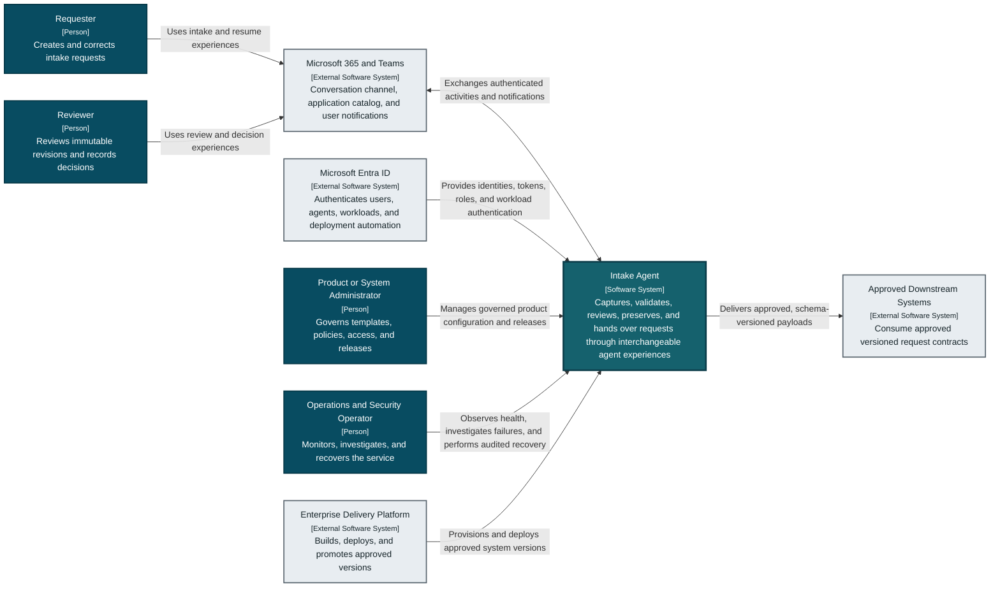

**C4 legend:** dark teal nodes are people, the bordered teal node is the Intake Agent software system, and light nodes are external software systems. Level 1 intentionally omits agents, Azure resources, protocols, and network topology.

This view covers the primary actors and external dependencies for POC-01 through POC-04. Detailed ownership for capture, review, delivery, identity, operations, and accessibility appears in the Level 2 and behavioral views.

## 6. C4 Level 2: Container architecture

Hosted Agent and Prompt Agent are separate deployable/configurable containers inside one product boundary. Both depend on the same agent-neutral requester and reviewer contracts. The Prompt Agent is enabled for an environment only after its Teams publishing, Toolbox/MCP, OAuth identity passthrough, networking, accessibility, and observability capabilities pass the same release gates as the Hosted Agent.

```mermaid
flowchart LR
    Requester["Requester<br/><small>[Person]</small>"]
    Reviewer["Reviewer<br/><small>[Person]</small>"]

    Teams["Microsoft 365 and Teams<br/><small>[External System]</small>"]
    Bot["Azure Bot Service<br/><small>[External System]</small><br/>Authenticated channel proxy"]
    Entra["Microsoft Entra ID<br/><small>[External System]</small>"]
    Graph["Microsoft Graph<br/><small>[External System]</small><br/>Teams activity-feed notifications"]
    Targets["Approved Downstream APIs<br/><small>[External System]</small>"]

    subgraph Intake["Intake Agent - Software System"]
        subgraph Foundry["Microsoft Foundry Agent Service"]
            Hosted["Hosted Agent Variant<br/><small>[Container: Python]</small><br/>Code-based conversation orchestration"]
            Prompt["Prompt Agent Variant<br/><small>[Container: Foundry configuration]</small><br/>Configuration-based conversation orchestration"]
            RequesterTools["Requester Toolbox<br/><small>[Container: Versioned Toolbox]</small><br/>Four allow-listed requester tools"]
            ReviewerTools["Reviewer Toolbox<br/><small>[Container: Versioned Toolbox]</small><br/>Isolated review and decision tools"]
        end

        CommandService["Intake Command Service<br/><small>[Container: Python MCP on Container Apps]</small><br/>Identity boundary, deterministic application/domain behavior, persistence adapters, audit, and outbox"]

        subgraph Async["Asynchronous Processing"]
            Bus["Domain Event Bus<br/><small>[Container: Azure Service Bus]</small>"]
            Workers["State-changing Workers<br/><small>[Container group: Azure Functions]</small><br/>Outbox, notification, integration, completion, and retention"]
            EvalJob["Release Evaluation Job<br/><small>[Container: Container Apps Job]</small>"]
        end

        subgraph Data["Customer-owned Data Services"]
            Cosmos["Request Store<br/><small>[Container: Cosmos DB for NoSQL]</small>"]
            Blob["Evaluation Evidence Store<br/><small>[Container: Blob Storage]</small>"]
            Search["Approved Knowledge Index<br/><small>[Container: Azure AI Search]</small>"]
            Vault["Secret Store<br/><small>[Container: Key Vault]</small>"]
            Monitor["Operational Telemetry<br/><small>[Container: Application Insights and Log Analytics]</small>"]
        end
    end

    Requester -->|Uses| Teams
    Reviewer -->|Uses| Teams
    Teams <--> |Authenticated channel activities| Bot
    Bot <--> |Activity Protocol| Hosted
    Bot <--> |Activity Protocol after capability approval| Prompt
    Hosted -->|Requester operations| RequesterTools
    Hosted -->|Reviewer operations| ReviewerTools
    Prompt -->|Requester operations| RequesterTools
    Prompt -->|Reviewer operations| ReviewerTools
    RequesterTools -->|Requester OAuth scope; private MCP| CommandService
    ReviewerTools -->|Reviewer OAuth scope; private MCP| CommandService
    Entra -->|Agent identity tokens| Hosted
    Entra -->|Agent identity tokens| Prompt
    Entra -->|User OAuth consent and delegated credentials| RequesterTools
    Entra -->|User OAuth consent and delegated credentials| ReviewerTools
    Entra -->|Validates users, scopes, and workload identity| CommandService
    CommandService <--> |Managed identity; transactional access| Cosmos
    CommandService -->|Publishes committed outbox events| Bus
    Bus <--> |At-least-once events and results| Workers
    Workers -->|Reads revisions and records results| Cosmos
    Workers -->|Reads exceptional secrets| Vault
    Workers -->|Sends notifications| Graph
    Workers -->|Delivers versioned contracts| Targets
    Hosted -->|Read-only grounding| Search
    Prompt -->|Read-only grounding| Search
    EvalJob <--> |Datasets and signed scorecards| Blob
    Hosted -->|Agent traces| Monitor
    Prompt -->|Agent traces| Monitor
    CommandService -->|Application telemetry| Monitor
    Workers -->|Worker telemetry| Monitor

    classDef person fill:#084c61,color:#fff,stroke:#063847,stroke-width:2px;
    classDef container fill:#15616d,color:#fff,stroke:#0b3c49,stroke-width:2px;
    classDef external fill:#e8edf1,color:#17252a,stroke:#5b6770,stroke-width:2px;
    class Requester,Reviewer person;
    class Hosted,Prompt,RequesterTools,ReviewerTools,CommandService,Bus,Workers,EvalJob,Cosmos,Blob,Search,Vault,Monitor container;
    class Teams,Bot,Entra,Graph,Targets external;
```

**C4 legend:** dark teal nodes inside the Intake Agent boundary are runtime or configuration containers owned as part of the product; light nodes are external systems. The shared Python packages are intentionally omitted because code packages are Level 3 implementation elements, not C4 containers.

Provisioning, administration, and operator relationships are intentionally kept in the Level 1, deployment, and CI/CD views so this Level 2 view remains readable. The worker group is expanded into independently permission-scoped Function Apps or equivalent hosts when RBAC differs materially. Notification, integration, retention, and completion processing must not inherit broader permissions merely because they use the same runtime technology.

## 7. Component responsibilities

### 7.1 Teams channel and Foundry publishing

Foundry publishes each approved agent variant through a stable, separately identifiable endpoint to Teams and Microsoft 365:

- Creates or associates an Azure Bot Service resource.
- Generates the Teams application manifest.
- Enables the Activity Protocol.
- Configures tenant authorization for organisation-wide use.
- Submits the agent to the organisation catalog for Microsoft 365 administrator approval.

Production uses pinned, approved Hosted and Prompt Agent versions. `Always use latest` is acceptable only in development. Non-production catalog entries identify the variant clearly; a common production alias is not introduced until comparative evidence supports the routing decision.

For a pilot, Foundry can publish the generated manifest directly. For production, use Foundry's **Download and customize** path so the same Foundry-generated application package can declare the Entra application information, notification activity types, deep links, and resource-specific consent required by the notification design. The customized package is submitted through the organisation's normal Teams application approval process; it does not add a custom bot host.

No custom Teams bot service is included in the MVP. A custom channel adapter is added only if a spike proves that required Adaptive Card actions, proactive notifications, attachments, or accessibility behavior cannot be delivered through native Foundry publishing. Each variant must independently prove native publishing, authenticated identity propagation, Toolbox/MCP access, accessibility, and required interaction support before production enablement.

### 7.2 Interchangeable agent adapters

The Python Hosted Agent and Prompt Agent are adapters at the probabilistic edge. Both variants:

- Interpret user messages.
- Propose candidate values and source spans where the runtime supports structured extraction.
- Request the active request state and allowed actions.
- Invoke only tools exposed by the approved requester or reviewer Toolbox version.
- Explain deterministic validation results in user-friendly language.
- Generate focused clarification questions from confirmed gaps.
- Summarize a revision for user review.
- Present workflow actions only when the Intake Command Service reports them as allowed.

Neither agent variant may:

- Grant permissions.
- Decide whether a user is a reviewer.
- Directly change lifecycle state or persist request data.
- Directly approve or reject a request.
- Supply identity context, credentials, tenant IDs, user IDs, role claims, or authorization results through model-generated arguments.
- Import or call repositories, Azure data SDKs, or worker-only commands.
- Treat generated confidence as authoritative.
- Execute arbitrary URLs, code, SQL, or unregistered MCP tools.

On every conversation turn, before interpreting the next action, the active adapter invokes `get_intake_context`. The persisted request aggregate is always authoritative; Foundry conversation state is ephemeral transcript context and is never used as the source of truth for fields, lifecycle, permissions, or the current revision. A requester may resume through either variant when product policy permits because both resolve the same tenant, user, and request identifiers. This rehydration rule resolves divergence after retries, cross-variant resume, session loss, or partial platform failure.

The shared agent behavior specification defines terminology, safety rules, workflow intent, tool-use rules, response requirements, and evaluation examples. Variant-specific instructions contain only runtime concerns that cannot be shared. Shared behavior and MCP contract tests, not identical prompt text, are the authoritative reuse mechanism.

### 7.3 C4 Level 3: Agent and command-service components

Requester and reviewer Toolboxes use separate custom OAuth identity-passthrough connections and delegated scopes. The Teams Activity carries tenant and user identifiers for channel context, but it is not the bearer credential sent to MCP. On first use, expiry, or revocation, Foundry returns an `oauth_consent_request`; the active adapter must surface the consent link to the user and resume the pending interaction only after authorization succeeds. Foundry stores and refreshes the resulting user credential for the configured connection. The Prompt Agent relies on the managed runtime for this exchange. The Hosted Agent must use the supported Toolbox integration, preserve per-request call context, surface consent, and resume safely.

The MCP authentication boundary validates signature, exact issuer and tenant, application audience, lifetime, authorized client, and the surface-specific delegated scope before deriving immutable actor identity from `tid` and `oid`. It accepts no Activity identifier, caller-supplied header, or model argument as proof of identity, and accepts no caller- or model-supplied role, request, correlation, idempotency, or authorization result. Trusted protocol metadata may supply bounded conversation, correlation, and idempotency context only after it is cryptographically associated with the authenticated invocation. Missing or conflicting context fails closed.

The delegated token authorizes the represented user's product operation and stops at the MCP boundary. The deterministic authorization layer combines its validated claims with request ownership, review assignment, classification, state, and separation-of-duties policy. A separate command-service managed identity accesses Cosmos DB and Service Bus. The delegated token is never forwarded to Azure data services.

```mermaid
flowchart LR
    subgraph AgentEdge["Agent Adapter Boundary"]
        Behavior["Shared Behavior Specification<br/><small>[Component: versioned policy and examples]</small>"]
        HostedAdapter["Hosted Agent Adapter<br/><small>[Component: Python orchestration]</small>"]
        PromptAdapter["Prompt Agent Adapter<br/><small>[Component: instructions and configuration]</small>"]
        RequesterClient["Requester Toolbox Client<br/><small>[Component: versioned tool contract]</small>"]
        ReviewerClient["Reviewer Toolbox Client<br/><small>[Component: versioned tool contract]</small>"]
        Behavior -.-> HostedAdapter
        Behavior -.-> PromptAdapter
        HostedAdapter --> RequesterClient
        HostedAdapter --> ReviewerClient
        PromptAdapter --> RequesterClient
        PromptAdapter --> ReviewerClient
    end

    subgraph CommandService["Intake Command Service"]
        Auth["OAuth Authentication Boundary<br/><small>[Component]</small>"]
        Actor["Immutable Actor Context Factory<br/><small>[Component]</small>"]
        RequesterPort["Requester Tool Port<br/><small>[Component]</small>"]
        ReviewerPort["Reviewer Tool Port<br/><small>[Component]</small>"]
        Handlers["Application Command and Query Handlers<br/><small>[Component]</small>"]
        Domain["Deterministic Domain Policies<br/><small>[Component]</small>"]
        Repositories["Repository, Idempotency, Audit, and Outbox Adapters<br/><small>[Component]</small>"]
        Telemetry["Telemetry and Redaction<br/><small>[Component]</small>"]

        Auth --> Actor
        Actor --> RequesterPort
        Actor --> ReviewerPort
        RequesterPort --> Handlers
        ReviewerPort --> Handlers
        Handlers --> Domain
        Handlers --> Repositories
        Domain --> Repositories
        Handlers --> Telemetry
    end

    RequesterClient -->|Private MCP; requester scope| Auth
    ReviewerClient -->|Private MCP; reviewer scope| Auth
    Repositories <--> Cosmos["Cosmos DB<br/><small>[Container]</small>"]
    Repositories --> Bus["Service Bus<br/><small>[Container]</small>"]

    classDef adapter fill:#15616d,color:#fff,stroke:#0b3c49,stroke-width:2px;
    classDef component fill:#2c7a7b,color:#fff,stroke:#164e63,stroke-width:2px;
    classDef data fill:#e8edf1,color:#17252a,stroke:#5b6770,stroke-width:2px;
    class Behavior,HostedAdapter,PromptAdapter,RequesterClient,ReviewerClient adapter;
    class Auth,Actor,RequesterPort,ReviewerPort,Handlers,Domain,Repositories,Telemetry component;
    class Cosmos,Bus data;
```

Every invocation records verified user and tenant identifiers, authenticated agent and workload identities, request and expected revision, activity/conversation references where available, correlation and idempotency identifiers, `agentKind`, agent/configuration version, model, instructions, Toolbox, MCP contract, template, schema, and policy versions.

The application and domain layers own:

- Template and schema version management.
- Request creation, retrieval, autosave, and resume.
- Field-level validation and source attribution.
- Deterministic completeness and contradiction rules.
- Confidence policy and low-confidence escalation.
- Clarification count and stop conditions.
- Lifecycle state-machine enforcement.
- Request-level and action-level authorization.
- Optimistic concurrency and immutable revision creation.
- Review comments, decisions, and rationale.
- Audit event creation.
- Outbox event creation in the same logical update as domain state.
- Idempotency for all mutating commands.

#### Package and dependency boundaries

The repository produces private, versioned contracts and deterministic Python packages. Agent adapters share schemas and behavior specifications but do not bundle application, persistence, or domain implementations:

```text
intake-hosted-adapter  -> intake-agent-contracts + intake-agent-behavior
intake-prompt-config   -> intake-agent-contracts + intake-agent-behavior
intake-mcp             -> intake-agent-contracts + intake-application + intake-persistence
intake-workers         -> intake-application + intake-persistence
intake-application     -> intake-domain
intake-persistence     -> intake-domain
intake-domain          -> Python standard library and approved domain-only dependencies
```

Dependencies point inward. Agent/orchestration modules cannot import application implementations, persistence modules, repositories, Azure SDK clients, credential providers, or mutable identity implementations. MCP schemas contain no Foundry run/thread objects, prompt text, Teams card payloads, or channel-specific state. CI uses import-boundary and schema-compatibility contracts to enforce these rules.

The deterministic packages are built once per release and promoted with the command service and state-changing workers. Agent variants are versioned and rolled back independently against compatible immutable MCP contract versions. Release evidence records every package and contract version and rejects an untested combination.

### 7.4 Command trust surfaces

The requester Toolbox exposes only these agent-neutral tools:

| Tool | Purpose | Mutating | Required controls |
|---|---|---:|---|
| `get_intake_context` | Resolve or load the authorised request and return template, revision, gaps, and allowed actions | Conditional create | Requester scope; deterministic tenant/user mapping; idempotent create |
| `update_intake_field` | Validate and persist bounded candidate field updates with source and confidence | Yes | Requester scope; ownership; expected revision; idempotency key |
| `submit_intake_for_review` | Validate completeness and transition an immutable revision to In Review | Yes | Requester scope; ownership; quality policy; expected revision; idempotency key |
| `list_my_intake_requests` | Return a bounded summary of requests visible to the represented user | No | Requester scope; request-level authorization; no sensitive field values |

The reviewer Toolbox is a separate contract and delegated scope:

| Tool | Purpose | Mutating | Required controls |
|---|---|---:|---|
| `list_assigned_reviews` | Return bounded summaries assigned to the reviewer | No | Reviewer scope; assignment or administrator policy |
| `get_review_context` | Return an immutable revision, prior feedback, and allowed review actions | No | Reviewer scope; assignment; request-level authorization |
| `add_review_comment` | Add a traceable comment without editing requester content | Yes | Reviewer scope; assignment; expected revision; idempotency key |
| `request_intake_changes` | Record required feedback and transition to Awaiting User Feedback | Yes | Reviewer scope; assignment; rationale; expected revision; idempotency key |
| `decide_intake_review` | Approve or reject the exact immutable revision | Yes | Reviewer scope; assignment; separation of duties; rationale; expected revision; idempotency key |

Schemas reject unknown properties and enforce bounded payload sizes. Results distinguish validation, authorization, conflict, throttling, transient, and permanent failures through stable codes. An agent may explain a result but may not convert failure into success or present an action absent from `allowedActions`.

`get_intake_context` uses a deterministic request identifier derived from trusted tenant, user, and bounded conversation metadata plus a conditional create. Concurrent first messages resolve to one active request rather than creating duplicate drafts. Cross-variant resume resolves requests from product data, not agent conversation state.

Service-only commands are not exposed to the model:

| Command | Allowed workload | Effect |
|---|---|---|
| `record_delivery_result` | Integration worker | Records delivery success, retryable failure, or permanent failure |
| `complete_request_if_ready` | Completion worker | Transitions `Approved` to `Completed` only when enabled mandatory handoffs satisfy policy |
| `record_notification_result` | Notification worker | Records notification delivery and exhausted retry status |

Workers execute these commands through the bundled `intake-domain` package with immutable service actor context derived from their managed identity. They do not patch request state directly.

### 7.5 Asynchronous workers

| Worker | Responsibility |
|---|---|
| Outbox dispatcher | Publishes committed domain events to Service Bus and marks them delivered |
| Notification worker | Sends actionable Teams notifications through an approved mechanism |
| Integration worker | Delivers approved versioned payloads with idempotency and contract validation |
| Completion worker | Applies completion policy after enabled mandatory delivery events |
| Evaluation job | Executes benchmark suites, produces a signed scorecard, and records release metrics |
| Retention worker | Applies deletion, retention, and legal-hold policies across all stores |

Workers use bounded retries. Permanent failures and exhausted retries move to a dead-letter queue with an operator-visible recovery action.

The notification worker uses the Microsoft Graph Teams activity-feed notification API as the primary out-of-session reminder. The customized Teams manifest includes `webApplicationInfo`, declares the required activity types, and requests the narrow `TeamsActivity.Send.User` resource-specific consent permission. Notifications deep-link to the agent or request context. A dedicated Entra application identity sends notifications using app-only authentication without a stored client secret. Hardened egress permits the required `graph.microsoft.com` endpoints. If delivery exhausts retries, the event is dead-lettered, operators are alerted, and reviewers still see an authoritative pending-review list when they next open the agent. In-conversation responses continue through the native Foundry Activity Protocol.

The retention worker invokes supported Foundry conversation/thread deletion operations and records verification without retaining deleted content. Exact APIs, configurable retention, and deletion semantics must be validated against the selected Foundry API version. If policy-required deletion cannot be executed and evidenced across Foundry conversation state, production launch is blocked.

## 8. Data architecture

### 8.1 Domain model

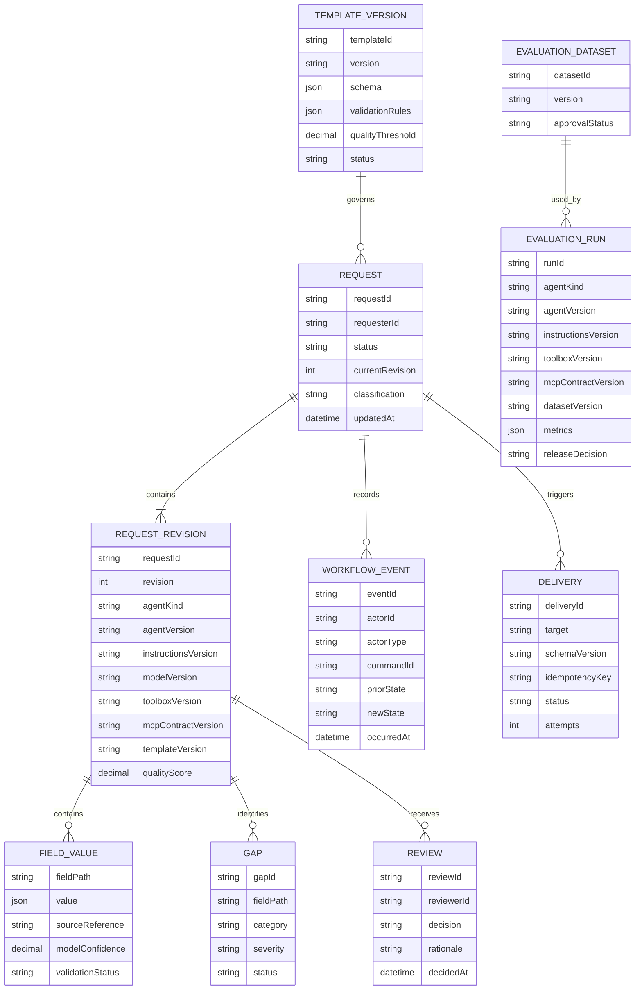

### 8.2 Cosmos DB design

Business data uses customer-owned Cosmos DB for NoSQL.

| Container | Partition key | Contents |
|---|---|---|
| `requests` | `/requestId` | Request projection, revisions, fields, gaps, reviews, workflow events, and outbox items |
| `templates` | `/templateId` | Immutable versions and active-version metadata |
| `deliveries` | `/requestId` | Downstream delivery attempts and status |
| `evaluations` | `/datasetId` | Dataset metadata, run metadata, metrics, and release decisions |
| `idempotency` | `/scopeId` | Command keys and replay-safe results; default TTL is 7 days for interactive commands and 30 days for asynchronous deliveries |

Request-owned records share `requestId` so reads and transactional batches stay within one logical partition. Current projections use ETags. Workflow events and approved revisions are immutable.

Foundry standard setup also provisions Foundry-owned container structures inside the customer Cosmos DB account for conversations and run state. Product code must not depend on their internal schema.

The idempotency TTL must always exceed the longest configured retry, lock renewal, scheduled redelivery, and approved operator replay window. Resilience tests verify command replay immediately before and after the configured boundary. Foundry containers and product containers receive separate capacity budgets and alerts so platform conversation traffic cannot exhaust the request system's provisioned throughput.

### 8.3 Evaluation evidence storage

Blob Storage is not used for generated request documents in the MVP. A separate non-production storage account contains versioned benchmark datasets and signed evaluation evidence. It uses a separate encryption scope, separate Entra groups, and an independent retention policy. Production managed identities cannot read benchmark expected results. Approved evaluation jobs receive time-bound access to the required dataset version and write only to the designated evidence path where practical.

### 8.4 Search and grounding

Azure AI Search is used only for approved enterprise knowledge:

- Template guidance.
- Policy definitions.
- Controlled examples.
- Domain glossaries.

Retrieved content is treated as untrusted data, not system instruction. Every grounded answer records source identifiers. Request business state is read through the Intake Command Service, not agent memory or vector search.

Search is exposed through a Foundry-managed Azure AI Search tool, not the internal command facade. The dedicated agent identity receives read-only Search Index Data Reader access only to approved indexes. Search has no write or administrative permission and cannot access request business-state containers.

## 9. Lifecycle and concurrency

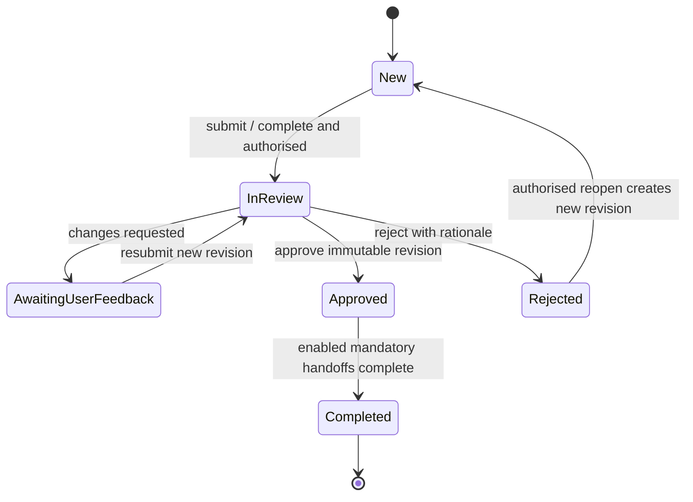

Rules:

- `New` includes editable draft behavior.
- Every mutating command includes an expected revision or ETag.
- A conflict returns the latest revision and never silently overwrites another edit.
- Approval records the exact immutable revision.
- Approval invokes completion policy; when no mandatory handover is enabled, the approved request completes immediately.
- Changes after approval require a new revision and review cycle.
- Reopening a rejected request is explicit and audited.
- A completed request is not edited; follow-up work creates a related request.

### 9.1 State-transition authorization matrix

| From | Command | To | Allowed actor | Required conditions |
|---|---|---|---|---|
| None | Create | New | Authenticated requester | No active draft already mapped to the conversation unless explicitly creating another |
| New | Submit | In Review | Request owner or authorised administrator | Mandatory fields complete; quality threshold met; expected revision matches |
| In Review | Request changes | Awaiting User Feedback | Assigned reviewer or authorised administrator | Comment/rationale supplied; expected revision matches |
| Awaiting User Feedback | Resubmit | In Review | Request owner or authorised administrator | New immutable revision created; mandatory fields complete |
| In Review | Approve | Approved | Assigned reviewer or authorised administrator | Reviewer is not disallowed by separation-of-duties policy; rationale captured |
| In Review | Reject | Rejected | Assigned reviewer or authorised administrator | Rationale captured |
| Approved | Complete | Completed | Completion worker or authorised administrator | Enabled mandatory handoffs succeeded |
| Rejected | Reopen | New | Request owner or authorised administrator | New revision created and reopen rationale recorded |

Any unlisted transition is denied. The deterministic domain layer enforces this matrix; either agent adapter presents only actions returned by its authorised context tool.

## 10. Key interaction flows

### 10.1 Capture and clarification

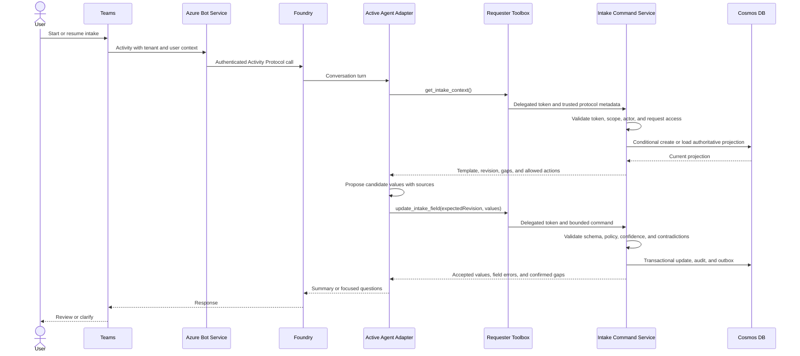

### 10.2 Review and approval

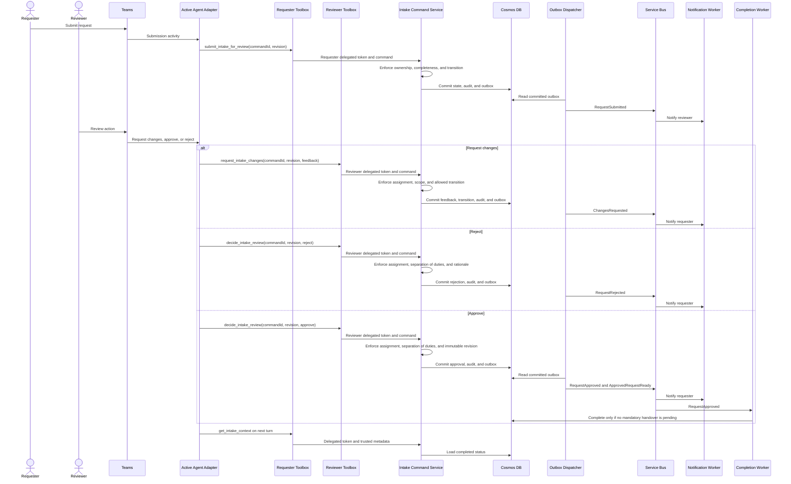

### 10.3 Downstream delivery

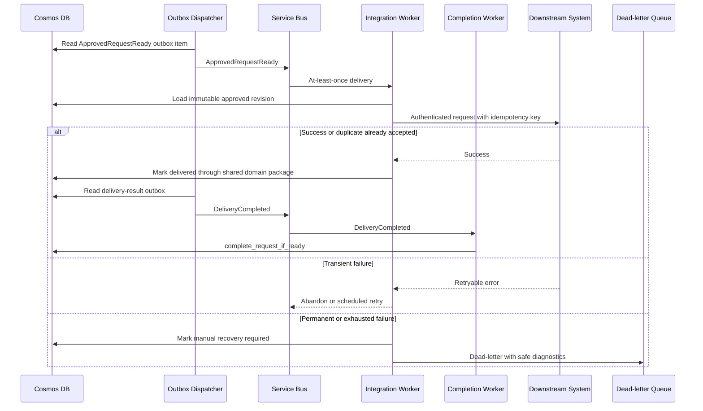

## 11. Command and event boundaries

### 11.1 Internal command conventions

- Typed Python command and result models.
- `commandId` required for mutating commands.
- Explicit `expectedRevision` required for concurrent updates.
- Stable error codes and structured failure results.
- Maximum request and field sizes enforced before model or persistence processing.
- User identity and agent identity are both recorded when the agent acts on behalf of a user.
- Repository and identity-context dependencies are constructed outside model-controlled code and injected only into command handlers.

Representative command handlers:

```python
get_intake_context(context, query)
update_intake_field(context, command)
submit_intake_for_review(context, command)
list_assigned_reviews(context, query)
get_review_context(context, query)
add_review_comment(context, command)
request_intake_changes(context, command)
decide_intake_review(context, command)
```

### 11.2 Domain events

Events use an envelope containing `eventId`, `eventType`, `eventVersion`, `requestId`, `revision`, `correlationId`, `causationId`, `occurredAt`, `actor`, and `data`.

Initial event types:

- `RequestCreated`
- `RequestFieldsUpdated`
- `ClarificationRequired`
- `RequestSubmitted`
- `ReviewFeedbackAdded`
- `RequestApproved`
- `RequestRejected`
- `DeliveryRequested`
- `DeliveryCompleted`
- `DeliveryFailed`
- `RequestCompleted`
- `RetentionDeletionRequested`

Consumers ignore unknown additive fields, reject unsupported major event versions, and deduplicate by `eventId`.

## 12. Identity and authorization

### 12.1 Identity boundaries and token flow

Identity does not pass from Teams to the Intake Command Service as one unchanged token. Each boundary authenticates a different principal for a different purpose:

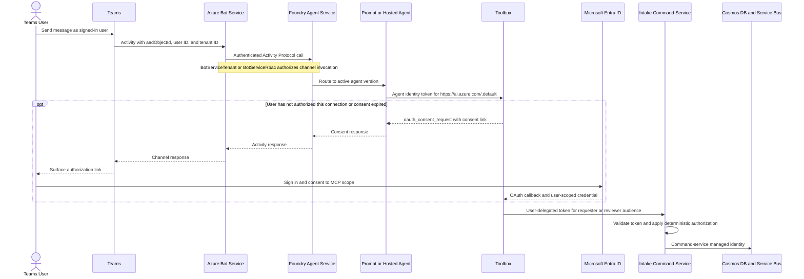

The boundaries are:

1. **Teams user context.** Authenticated Teams activities contain user and tenant identifiers. They are channel context and correlation inputs, not downstream bearer credentials and not sufficient proof for a product authorization decision.
2. **Bot Service channel authorization.** Azure Bot Service proxies the Activity to the agent endpoint. `BotServiceTenant` permits tenant users; `BotServiceRbac` additionally requires Foundry invocation permissions. This authorizes invocation of the agent, not access to a request.
3. **Agent-to-Toolbox authentication.** The active agent authenticates to the Toolbox consumer endpoint with its agent identity. Publishing or deploying a production agent can change the runtime principal, so required roles are assigned to the actual production `instance_identity` and verified after deployment.
4. **Toolbox-to-MCP authorization.** The connection determines which credential reaches MCP. The requester and reviewer MCP connections use custom `oauth2`, not project-managed or agentic identity, so MCP receives a user-delegated token for its own audience and scope.
5. **MCP data-plane access.** MCP authorizes the user from validated token claims, then uses the command-service managed identity for Cosmos DB and Service Bus. Product data services never receive the user's token.

OAuth passthrough requires a same-tenant user and at least the least-privilege Foundry consumer role supported by the selected API version. The current platform documentation identifies **Foundry Agent Consumer** for consumers, while some Toolbox provisioning documentation still states **Foundry User**; deployment validation must confirm the exact minimum role and assign it to governed requester/reviewer groups rather than individuals.

### 12.2 Variant obligations

| Concern | Prompt Agent | Hosted Agent |
|---|---|---|
| Activity invocation | Foundry-managed Activity Protocol | Foundry-managed Activity Protocol |
| Runtime identity | Agent identity associated with the deployed/published agent | Dedicated Hosted Agent identity associated with the deployed/published agent |
| Toolbox client | Managed agent/tool configuration | Supported Foundry Toolbox runtime integration |
| Per-user context | Preserved by the managed runtime | Forward the runtime's per-request call context; never invent a user identifier |
| OAuth consent | Surface platform consent response through Teams | Surface `oauth_consent_request`, pause safely, and resume the exact interaction after consent |
| Tool approval | Enforce configured platform approval behavior | Enforce `require_approval` in code; a prompt instruction is insufficient |

Neither variant is production-capable until an end-to-end Teams test proves consent, token audience and claims, cross-user isolation, revocation/reconsent, requester/reviewer scope separation, and recovery after an interrupted consent flow.

### 12.3 Identity types

| Actor | Identity | Use |
|---|---|---|
| Teams user | Microsoft Entra user identity plus Teams Activity identifiers | Channel interaction and correlation; Activity identifiers alone do not authorize product access |
| Azure Bot Service | Agent-bound single-tenant bot registration | Authenticate and proxy Teams Activity Protocol calls to the configured Foundry agent endpoint |
| Hosted Agent variant | Dedicated Foundry agent identity | Authenticate to approved Toolbox and Search surfaces, monitoring, and attributable orchestration; no product data-plane access |
| Prompt Agent variant | Foundry agent identity for the deployed/published agent | Authenticate to approved Toolbox and Search surfaces, monitoring, and attributable orchestration; no product data-plane access |
| Toolbox OAuth connection | User-delegated Entra credential scoped to requester or reviewer MCP | Authorize an MCP call as the user who completed consent; isolated per user and connection |
| Intake Command Service | Delegated Entra user token plus dedicated managed identity | Authorize requester/reviewer operations as the user; access product Cosmos DB and Service Bus as the workload |
| Notification worker | Dedicated Entra application and workload identity | Consume notification jobs and call Microsoft Graph with approved RSC |
| Integration worker | Dedicated managed identity per integration trust boundary | Consume deliveries, call approved target, and invoke delivery-result commands |
| Completion worker | Dedicated managed identity | Evaluate completion policy and invoke `complete_request_if_ready` |
| Evaluation job | Dedicated managed identity | Read approved benchmark version, invoke the test agent, and write evaluation evidence |
| Retention worker | Dedicated managed identity | Apply approved deletion and legal-hold policy across in-scope stores |
| CI/CD | Workload identity federation | Infrastructure and application deployment without stored client secrets |

The interactive pattern is used for user-driven actions. Toolbox custom OAuth performs the user authorization and token lifecycle; the Intake Command Service does not implement a second token broker. System-wide background work uses a dedicated workload identity with narrowly scoped application permissions.

For all interactive commands, independently protected actor values are recorded: the validated delegated Entra user is the represented user, the authenticated agent identifies the orchestration variant, and the command-service managed identity is the data-access workload. Model/tool arguments cannot set or override these values. Requester and reviewer commands use different delegated scopes and tool registrations.

### 12.4 Least-privilege resource access

| Identity | Minimum data-plane access |
|---|---|
| Requester/reviewer user groups | Agent-store/app-policy access; least-privilege Foundry consumer role required by OAuth passthrough; consent only to the applicable MCP delegated scope |
| Azure Bot Service | Activity Protocol channel binding to the configured agent endpoint; no product data role |
| Hosted Agent variant | Foundry/Toolbox consumption; Search Index Data Reader on approved indexes where required; monitoring ingestion; no product request-data role |
| Prompt Agent variant | Foundry/Toolbox consumption; Search Index Data Reader on approved indexes where required; monitoring ingestion; no product request-data role |
| Intake Command Service | Cosmos DB Built-in Data Contributor scoped to product databases/containers; Service Bus Data Sender scoped to the domain-event entity; monitoring ingestion |
| Outbox dispatcher | Read/update product outbox records and Service Bus Data Sender |
| Notification worker | Service Bus Data Receiver and approved Microsoft Graph `TeamsActivity.Send.User` RSC |
| Integration worker | Service Bus Data Receiver, product delivery-container access, and target-specific credentials or delegated role |
| Evaluation job | Read-only benchmark storage, write-only evidence path where practical, and permission to invoke the test Agent Application |
| Retention worker | Delete access only to stores covered by the approved retention workflow |

Neither agent variant has a product request-data role. The command-service identity has no access to Foundry-owned Cosmos DB containers, no Service Bus
receiver role, and no Key Vault secret access by default. Delegated user tokens
are not sent to Azure data services. Exceptional non-Entra credentials belong
to the specific worker that needs them and are read from Key Vault under a
separate identity.

### 12.5 Role model

| Action | Requester | Reviewer | Administrator | Service |
|---|---:|---:|---:|---:|
| Create request | Yes | Yes | Yes | No |
| View owned request | Yes | Policy | Yes | Scoped |
| Edit draft/feedback revision | Owner | No | Exceptional | No |
| Submit for review | Owner | No | Exceptional | No |
| Comment on review | No | Assigned | Yes | No |
| Approve/reject | No | Assigned | Policy | No |
| Manage templates | No | No | Yes | No |
| Deliver downstream | No | No | Configure | Worker |
| View restricted telemetry | No | No | Policy | Operator |

Entra groups or app roles provide coarse roles. The Intake Command Service combines validated claims with ownership, assignment, classification, current state, and action through deterministic authorization policies. Agent variants receive only the resulting allowed actions and bounded data.

## 13. Security and privacy

### 13.1 Threat controls

| Threat | Controls |
|---|---|
| Direct prompt injection | System/user content separation, constrained tools, schema validation, allow-listed actions, Foundry guardrails |
| Indirect prompt injection from retrieved content | Treat retrieval as data, source allow-list, content filters, no instruction authority, output validation |
| Excessive agency | No generic execution tools, least-privilege identities, command authorization in Core, approval for consequential actions |
| Data disclosure | Request-level authorization, classification, redaction, private endpoints, no public blobs, bounded tool responses |
| Tampering | ETags, immutable revisions, checksums, audit events, signed deployment artifacts |
| Replay and duplication | Idempotency keys, event IDs, Service Bus duplicate handling, consumer deduplication |
| Secret exposure | Managed identities, workload federation, Key Vault, secret scanning, no secrets in prompts or manifests |
| Poisoned evaluation data | Dataset approvals, separation from development examples, provenance, access control, versioning |
| Unsafe model change | Pinned versions, evaluation gate, staged rollout, rollback |

### 13.2 Data lifecycle

- Classify fields before launch and apply policy by classification.
- Encrypt in transit and at rest; use customer-managed keys if governance requires them.
- Redact sensitive values from logs, metrics dimensions, queue diagnostics, and evaluation exports.
- Keep production requests out of benchmark datasets unless approved, minimized, and redacted.
- Apply retention consistently across Cosmos DB, Foundry conversation state, Blob Storage, Search indexes, telemetry, backups, and dead-letter messages.
- A deletion workflow records scope and completion without retaining deleted content.
- Legal hold overrides routine deletion through an explicit, audited policy.
- Block production launch until Foundry conversation-state expiry/deletion can be configured, invoked, and evidenced to satisfy the approved policy.

## 14. Deployment architecture

### 14.1 Environment isolation

Development, test, and production use separate Foundry projects and separate application/data resources. Production should use a separate subscription where enterprise policy requires a stronger trust boundary.

Each environment also receives a dedicated workload-profile Container Apps managed environment in the Intake Agent VNet. It is not shared with unrelated applications. The dedicated environment provides an explicit network, identity, scaling, diagnostics, and lifecycle boundary for the private command service, containerized Functions workers, and evaluation job.

Resource naming, tags, diagnostics, Azure RBAC, budgets, locks, and policies are
deployed with Bicep. GitHub Actions uses workload identity federation. Entra
application registrations, delegated scopes, redirect URIs, preauthorization,
and tenant/admin consent are tenant-scoped and are not resources owned by the
resource-group-scoped Bicep deployment. They require a separately governed,
idempotent setup procedure and redacted evidence; documentation does not imply
that procedure is implemented.

Bicep is the infrastructure source of truth, and Azure Developer CLI (`azd`) is the shared deployment contract for developers and automation. The repository contains `azure.yaml` and an `infra/` folder; `azd provision`, `azd deploy`, and `azd up` respectively provision infrastructure, deploy application components, and perform the clean-environment end-to-end deployment. GitHub Actions authenticates through workload identity federation and invokes the same Bicep/`azd` contract rather than maintaining a separate deployment implementation. Secrets are never stored in committed parameter files or `azd` environment files.

### 14.2 C4 deployment view: baseline enterprise variant

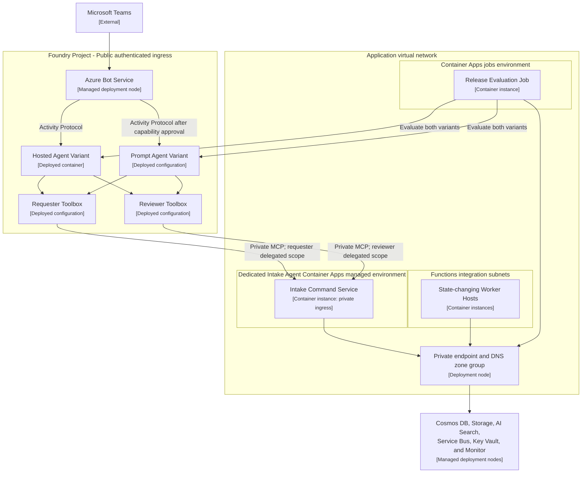

Characteristics:

- Foundry ingress remains public but requires Microsoft Entra and tenant authorization.
- Customer-owned data services use private endpoints and public network access disabled where supported.
- The Intake Command Service uses internal ingress and a dedicated data-plane identity; neither agent identity receives product request-data roles.
- Requester and reviewer Toolboxes use separate delegated scopes and tool allow-lists against the same private runtime.
- Prompt Agent is deployed only after private MCP reachability, OAuth identity passthrough, and Teams publishing are validated for the selected Foundry API version and region.
- Native Foundry portal publishing is available for pilots; production downloads and customizes the generated manifest for notifications and enterprise app policy.
- This is the preferred pilot topology when compliance permits.

### 14.3 C4 deployment view: hardened private variant

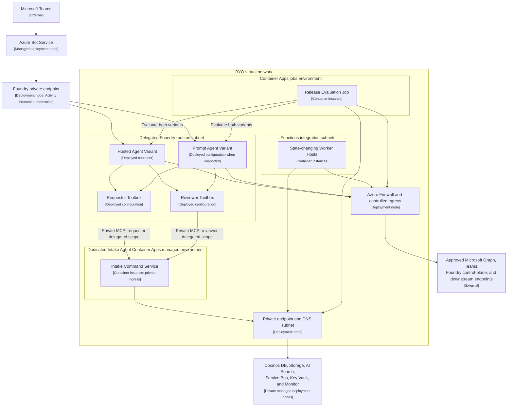

Characteristics:

- The Foundry account is created with BYO VNet networking and public access disabled.
- Use a dedicated delegated subnet. Start production sizing at `/24` for combined agent concurrency and rolling revision headroom; confirm with load estimates.
- Private DNS zones resolve Foundry and customer-owned services inside the network.
- Controlled egress permits only approved destinations.
- The egress allow-list includes the Microsoft Graph and Teams endpoints required for activity-feed notifications and publishing operations.
- Teams publishing uses the documented Foundry REST flow because portal publishing is unavailable when public access is disabled.
- Every selected Foundry tool and both agent variants must be checked for private-network support. A variant that cannot meet the topology is disabled rather than granted public data access.
- Network injection cannot be retrofitted to an existing Foundry account; this decision is made before environment creation.

### 14.4 API Management

API Management is not placed between Teams and Foundry. It is optional for:

- External or cross-trust-boundary downstream APIs.
- Partner-facing future APIs.
- Centralized contract policy, quota, transformation, or mTLS requirements.

The agent-to-command-service MCP call is an internal application call and does not require API Management. API Management becomes relevant only for an external or cross-trust-boundary API, or when enterprise policy requires centralized contract controls that Toolbox and MCP cannot provide.

## 15. Reliability and recovery

- Persist each accepted field update before reporting success.
- Use Cosmos DB transactional batches for request projection, audit event, and outbox item within a request partition.
- Dispatch outbox records asynchronously and safely retry publication.
- Configure Service Bus dead-letter alerts and operator replay tooling.
- Apply bounded exponential backoff with jitter; never retry authorization or validation failures.
- Deliver only immutable approved revisions so retries are reproducible.
- Use delivery idempotency keys and persisted outcomes to suppress duplicates.
- Keep previous Hosted Agent, Prompt Agent configuration, Toolbox, command-service, and worker versions available for rollback.
- Promote one approved deterministic package build with the command service and state-changing workers; reject untested package or MCP contract combinations.
- Roll back either agent variant independently only to a version proven compatible with the active immutable MCP contract.
- Back up configuration, templates, policies, and infrastructure definitions in source control.
- Validate Cosmos DB continuous backup/point-in-time restore and Storage recovery settings against RPO/RTO.
- Test restore and regional recovery procedures at an agreed cadence.

## 16. Observability

### 16.1 Correlation

Propagate:

- `traceId`
- `correlationId`
- `requestId`
- `requestRevision`
- `commandId`
- `eventId`
- Teams `activityId` and conversation reference
- Foundry session/conversation and agent version
- `agentKind` (`hosted` or `prompt`), instructions version, Toolbox version, and MCP contract version

Sensitive content is excluded from standard logs. Restricted model traces use separate access and retention controls.

### 16.2 Signals

| Category | Measures |
|---|---|
| Experience | Completion, abandonment, clarification turns, time to complete, review cycle time |
| Quality | Capture accuracy, gap recall, false-positive gaps, contradiction detection, groundedness, reviewer acceptance |
| Agent | Model latency, token usage, tool calls, tool failures, guardrail events, prompt-injection detections |
| Application | Command latency, errors, conflicts, authorization denials, state-transition failures |
| Async | Queue depth, oldest message, retries, dead letters, notification and delivery status |
| Platform | Foundry Hosted and Prompt Agents, Container Apps, Functions, Cosmos DB, Storage, Search, and Service Bus health/capacity |
| Cost | Cost by agent kind, model/token use, Hosted Agent compute, Cosmos RU consumption, Search units, storage, and egress |

Alerts have an owner, threshold, severity, runbook, and escalation route.

## 17. Evaluation and testing architecture

### 17.1 Evaluation pipeline

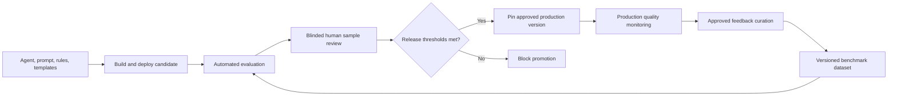

Evaluation records `agentKind`, agent/configuration, model, instructions, Toolbox, MCP contract, policy, template, schema, and dataset versions.

Release evaluation runs as a private Azure Container Apps Job with a unique `runId`. GitHub Actions starts the job, polls the authenticated evaluation-status endpoint for up to 60 minutes, and fails closed on timeout, job failure, missing metrics, or a non-passing `releaseDecision`. The job writes a machine-readable signed JSON scorecard and human-readable report to the evaluation evidence account. GitHub Actions retains the scorecard as release evidence. Scheduled production-quality checks may use the same job asynchronously but do not replace the release gate.

Metrics include:

- Field capture exact and semantic accuracy.
- Required-gap recall.
- False-positive gap rate.
- Contradiction precision and recall.
- Clarification relevance and repetition.
- Groundedness and unsupported-field rate.
- Completion rate and clarification burden.
- Reviewer acceptance and override rate.
- Critical privacy, authorization, prompt-injection, and unsafe-action failures.

Thresholds are set after a documented baseline. Both advertised variants run the same benchmark and must pass independently. Differential evaluation compares semantic capture, gaps, contradictions, questions, lifecycle outcomes, and security behavior without requiring identical prose. A critical security or data-integrity failure always blocks release.

### 17.2 Test layers

| Layer | Coverage |
|---|---|
| Unit | Validators, quality formula, state transitions, authorization policies, mapping, idempotency |
| Component | Hosted and Prompt adapters in isolation; command-service application/domain/repository components with emulated dependencies |
| Contract | Both agents against requester/reviewer MCP schemas; internal commands, events, and downstream payloads |
| Integration | Cosmos DB, Blob, Service Bus, Key Vault, Foundry tools, Graph/Teams notification path |
| End to end | Both variants: Teams intake, resume, clarification, submit, review, feedback, approve, downstream handover, completion |
| Cross-variant | Start with one variant, resume with the other, preserve provenance, and reject stale revisions |
| AI regression | Shared benchmark, differential outcomes, and adversarial cases over repeated runs where necessary |
| Security | Channel versus user-token separation, OAuth consent/revocation, token audience and claims, cross-user isolation, requester/reviewer scope separation, authorization, tenant isolation, injection, disclosure, dependency and container scanning |
| Resilience | Timeouts, duplicate delivery, concurrency conflict, dependency outage, poison messages, restore |
| Performance | Concurrent sessions, command latency, request payload size, queue throughput, and Cosmos RU consumption |
| Accessibility | Keyboard, screen-reader semantics, contrast, focus, card actions, actionable errors |

## 18. CI/CD and release

```mermaid
flowchart LR
    PR[Pull request] --> Static[Lint, type, unit, security scans]
    Static --> Build[Build shared contracts, command service, workers, and Hosted Agent]
    Build --> AzdTest[Run azd provision and azd deploy]
    AzdTest --> DeployTest[Deploy both agent variants and shared test environment]
    DeployTest --> Tests[Shared contract, integration, cross-variant, and E2E tests]
    Tests --> Eval[Evaluate Hosted and Prompt variants; wait for signed scorecards]
    Eval --> Approval[Release approval]
    Approval --> Prod[Deploy services and pin compatible variant versions]
    Prod --> Smoke[Smoke-test each enabled Teams variant and telemetry]
    Smoke --> Complete[Release evidence retained]
```

Release artifacts:

- Bicep deployment and parameter versions.
- Python package/container digests and SBOM.
- Hosted Agent package, Prompt Agent configuration, shared behavior, model, instructions, Toolbox, and MCP contract versions.
- Template and schema versions.
- Automated test results.
- Evaluation scorecard and human review.
- Security and accessibility evidence.
- Migration, rollback, and runbook references.

Risky changes use staged rollout or a feature flag. Production never automatically selects the latest agent, prompt configuration, Toolbox, or contract version. Both advertised variants must pass independently; a temporary variant disablement requires an explicit, audited release decision and catalog/configuration change.

## 19. Backlog traceability

| Backlog epic | Primary architecture components and controls |
|---|---|
| 1. Structured Requirements Capture | Hosted/Prompt adapters, shared requester MCP contract, TemplateVersion, deterministic validation, revisions, source attribution |
| 2. Gap Analysis & Clarification | Shared behavior specification, variant adapters, deterministic gap rules, thresholds, clarification limits, evaluation metrics |
| 3. Approved Structured Output | Immutable approved revision in Cosmos DB, schema/version provenance, authorised Teams view, downstream contract source |
| 4. Persistence & Workflow | Cosmos DB, lifecycle state machine, ETags, autosave, audit events, outbox |
| 5. Human-in-the-Loop Review | Shared reviewer MCP contract, Entra reviewer roles, assignment, Teams actions, immutable decisions, feedback traceability |
| 6. Downstream Automation | Service Bus, integration worker, versioned contracts, managed identity, idempotency, DLQ |
| 7. Evaluation & Quality | Shared benchmark, per-variant and differential evaluation, Foundry tracing, scorecards, release gate |
| 8. Testing & QA | Shared contract suite, cross-variant resume, Teams E2E per variant, adversarial tests, CI gates |
| 9. Security, Privacy & Governance | Entra, agent identity, managed identity, Key Vault, private endpoints, retention, provenance |
| 10. Reliability, Observability & Operations | Outbox, queues, retries, telemetry, dashboards, runbooks, rollback, restore |
| 11. Experience & Accessibility | Teams-native UX, save/resume, clear errors, Adaptive Card validation, usability and WCAG testing |
| 12. Azure Infrastructure & Deployment | Both agent variants, shared command service, Bicep modules, `azure.yaml`, `azd`, identities, network variants, GitHub Actions federation |
| 13. POC Demo Script & Guide | Teams end-to-end scenario, resettable deployed environment, fixtures, expected outputs |
| 14. Deployment & Success Verification | Clean-environment `azd up`, deployed smoke tests, private connectivity proof, signed release evidence |
| 15. Architecture Decisions & Runbooks | ADR register, architecture/workflow diagrams, deployment/rollback/teardown runbooks, production gaps |

## 20. Delivery slices

### Slice 1: Foundation

- Bicep modules and environment structure.
- `azure.yaml` and an `azd` deployment contract shared by local and CI/CD deployment.
- Versioned agent-neutral MCP contracts, shared behavior specification, and deterministic package boundaries.
- Foundry development project, Prompt Agent configuration, and Python Hosted Agent skeleton.
- Customer-owned Cosmos DB, Storage, Search, Key Vault, monitoring, and managed identities.
- Entra groups/app roles.
- GitHub Actions CI and workload identity federation.

### Slice 2: Vertical intake path

- Native Teams publishing for separately labeled Hosted and Prompt pilot variants.
- Template loading and request creation.
- Candidate extraction, deterministic validation, autosave, and resume.
- Shared requester Toolbox/MCP surface and cross-variant resume.
- Foundry and application trace correlation.
- Initial unit, contract, integration, and Teams smoke tests.

### Slice 3: Clarification and evaluation

- Gap and contradiction rules.
- Confidence semantics and clarification limits.
- Versioned benchmark dataset.
- Automated evaluation and scorecard.
- Quality dashboards and release threshold baseline.

### Slice 4: Review and approval

- State machine and optimistic concurrency.
- Reviewer assignment and authorization.
- Separate shared reviewer Toolbox/MCP surface.
- Feedback, resubmission, approval, and rejection.
- Approved structured-revision view and notification path.
- End-to-end accessibility and usability validation.

### Slice 5: Production hardening

- Final baseline or hardened network topology.
- Data retention/deletion and backup/restore.
- Threat modeling, security and resilience tests.
- Production monitoring, alerts, runbooks, staged rollout, and rollback.
- Tenant-wide Microsoft 365 administrator approval.

### Slice 6: Downstream automation

- Versioned output contracts.
- Integration identities and optional API Management.
- Service Bus delivery, retries, idempotency, DLQ, and replay.
- Agent-to-agent endpoint only after its protocol and security design is approved.

## 21. Architecture decisions

| ID | Decision | Status |
|---|---|---|
| ADR-001 | Use native Foundry publishing to Teams; do not build a custom bot host for MVP | Accepted |
| ADR-002 | Use a Python Hosted Agent rather than a prompt-only agent | Superseded by ADR-017; Hosted Agent remains a supported adapter |
| ADR-003 | Deploy orchestration and deterministic core modules together as a Hosted Agent modular monolith | Superseded by ADR-015 and ADR-017 |
| ADR-004 | Use Foundry standard setup with customer-owned data resources | Accepted |
| ADR-005 | Use Cosmos DB request partitions, optimistic concurrency, audit events, and an outbox | Proposed |
| ADR-006 | Use Service Bus and Functions for asynchronous work | Proposed |
| ADR-007 | Pin approved production agent versions | Accepted |
| ADR-008 | Support baseline and hardened deployment variants until compliance selects one | Accepted |
| ADR-009 | Extract a Core service only for additional consumers, materially different scaling/release needs, or a required process trust boundary | Superseded by ADR-015 and ADR-017 |
| ADR-010 | Build deterministic behavior as private `intake-application` and `intake-domain` packages consumed by the command service and state-changing workers | Accepted; amended by ADR-017 to exclude agent adapters |
| ADR-011 | Use Bicep as the infrastructure source of truth and Azure Developer CLI (`azd`) as the shared local and CI/CD deployment contract | Accepted |
| ADR-015 | Extract the four requester tools behind a private Container Apps MCP boundary consumed through a versioned Foundry Toolbox with custom Entra OAuth passthrough | Accepted; amended by ADR-016/ADR-017 |
| ADR-016 | Expose reviewer actions through a separate versioned Toolbox/MCP contract and delegated scope on the shared command-service runtime | Accepted |
| ADR-017 | Support Hosted and Prompt Agents as interchangeable adapters over shared behavior and requester/reviewer MCP contracts; require equivalent business outcomes and independent release gates | Accepted; supersedes ADR-002 and completes the extraction begun by ADR-015 |
| ADR-018 | Separate Teams Activity context, Bot Service channel authorization, agent identity, Toolbox user OAuth, MCP authorization, and command-service data access; never use Activity identifiers as product credentials | Accepted |
| ADR-019 | Create a dedicated workload-profile Container Apps managed environment per Intake Agent environment; do not reuse a shared or pre-existing managed environment | Accepted |
| ADR-020 | Run only the Foundry Hosted Agent image with the platform-supported root model because the reserved `/home/session` mount must host Responses session state; keep all product workloads non-root and deny the Hosted identity product data-plane access | Accepted |

## 22. Risks and mitigations

| Risk | Impact | Mitigation |
|---|---|---|
| Native Foundry Teams publishing lacks a required interaction | Custom channel work delays MVP | Run an early spike for cards, attachments, OAuth consent links, interrupted-consent recovery, authenticated Activity context, and accessibility; use Graph activity-feed notifications for out-of-session reminders |
| Teams Activity identity is mistaken for a delegated credential | Cross-user access or authorization bypass | Treat Activity identifiers as context only; accept product identity only from the validated MCP access token; test token substitution and cross-user replay |
| Toolbox OAuth consent cannot complete through one agent variant | That variant cannot safely perform user-scoped operations | Require an end-to-end Teams consent, resume, revocation, and reconsent test for each variant; disable any variant that fails |
| Prompt Agent lacks a required Teams, Toolbox, OAuth, or private-network capability | Prompt variant cannot meet parity without weakening controls | Validate a capability matrix per API version/region; disable the variant when a mandatory capability is unavailable; never grant direct data access as a workaround |
| Shared behavior drifts between Hosted and Prompt variants | Inconsistent questions, tool use, or safety behavior | Version a shared behavior specification and run the same contract, benchmark, and human rubric against both variants |
| Activity Protocol is the only active protocol on an Agent Application | Future API consumers cannot use the same endpoint through Responses | Publish a separate Agent Application endpoint for API consumers if required |
| Foundry network choice cannot be retrofitted | Rebuild required to move from baseline to hardened | Decide production topology before production Foundry account creation; keep IaC portable |
| Hosted Agent subnet exhaustion | Sessions or rolling deployments fail | Capacity model concurrency and revisions; begin hardened production design at `/24` |
| Model output changes across versions | Quality regression | Pin versions, run benchmark evaluation, stage rollout, retain rollback version |
| Conversation state diverges from business state | Incorrect resume or decisions | Treat the persisted request aggregate as source of truth and reload it on every turn |
| Agent adapter becomes coupled to deterministic implementations | Portability and isolated testing fail | Agent adapters depend only on contracts and behavior specifications; CI blocks imports of application, persistence, Azure SDK, or credential modules |
| Command service and workers use different deterministic versions | State invariants or event schemas diverge | Build once, promote deterministic package versions together, record versions in telemetry, and test any compatibility window |
| Teams/Microsoft 365 processing conflicts with residency policy | Compliance block | Complete data-flow and governance review before tenant-wide publishing |
| Sensitive data enters traces or evaluation data | Privacy incident | Default redaction, restricted traces, dataset approval, automated scanning |
| Review notifications cannot be sent reliably | Slow workflow | Validate Graph activity-feed notifications early; provide an in-agent pending-review list, retries, dead-letter alerting, and operator recovery |
| Cosmos DB standard setup capacity is underestimated | Provisioning or runtime failure | Include Foundry container RU requirements and product workload in capacity planning |

## 23. Open decisions and validation spikes

1. Confirm the final production network variant with security and compliance.
2. Select model(s) and Azure region after checking Hosted Agent, Prompt Agent, tool, data-residency, networking, and quota support.
3. Validate both variants for native Teams publishing, Adaptive Cards, file handling, deep links, notifications, and required accessibility behavior.
4. Prove for both variants that Teams Activity identifiers remain channel context, Toolbox OAuth consent completes in Teams, MCP receives the correct user-delegated audience and scope, and Hosted Agent call context cannot be substituted by model-controlled arguments.
5. Define exact field confidence semantics and evaluation thresholds from a baseline dataset.
6. Confirm retention, legal hold, deletion, backup, and data-residency policy, including supported Foundry conversation-state deletion and evidence.
7. Estimate concurrency, message sizes, request payload sizes, Cosmos RU, queue throughput, and hardened subnet capacity.
8. Select the first downstream integration and define its contract, identity, timeout, and recovery behavior.
9. Confirm whether API Management is required by enterprise platform policy.
10. Decide the production routing/default after comparing Hosted and Prompt quality, latency, cost, operability, and accessibility evidence.
11. Decide whether independently permission-scoped workers require separate Function Apps or another host boundary.

## 24. Microsoft platform references

The design was checked against current Microsoft documentation:

- [What is Microsoft Foundry Agent Service?](https://learn.microsoft.com/azure/foundry/agents/overview)
- [Publish agents to Microsoft 365 Copilot and Microsoft Teams](https://learn.microsoft.com/azure/foundry/agents/how-to/publish-copilot)
- [Networking options for Foundry Agent Service](https://learn.microsoft.com/azure/foundry/agents/concepts/networking-options)
- [Deep dive into Foundry Agent Service networking](https://learn.microsoft.com/azure/foundry/agents/concepts/agents-networking-deep-dive)
- [Use your own resources with Foundry Agent Service](https://learn.microsoft.com/azure/foundry/agents/how-to/use-your-own-resources)
- [What are hosted agents?](https://learn.microsoft.com/azure/foundry/agents/concepts/hosted-agents)
- [Configure and share your agent](https://learn.microsoft.com/azure/foundry/agents/how-to/configure-agent)
- [Publish agents to Microsoft 365 Copilot and Teams using the REST API](https://learn.microsoft.com/azure/foundry/agents/how-to/publish-copilot-virtual-network)
- [How Toolbox authentication works](https://learn.microsoft.com/azure/foundry/agents/how-to/tools/tool-authentication)
- [Use a Toolbox with a Hosted Agent](https://learn.microsoft.com/azure/foundry/agents/how-to/tools/use-toolbox-hosted-agent)
- [Plan your agent identity architecture](https://learn.microsoft.com/entra/agent-id/how-to-plan-agent-identity-architecture)
- [Send activity feed notifications to users in Microsoft Teams](https://learn.microsoft.com/graph/teams-send-activityfeednotifications)

Platform preview status, regional support, quotas, protocol limitations, and networking/tool compatibility must be rechecked before each environment is provisioned.
