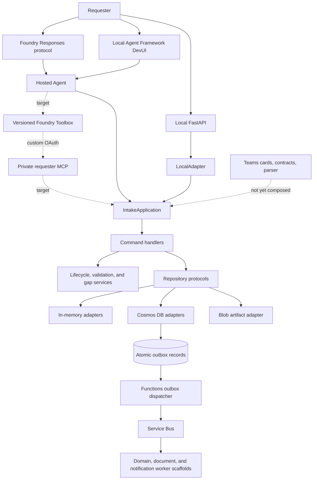
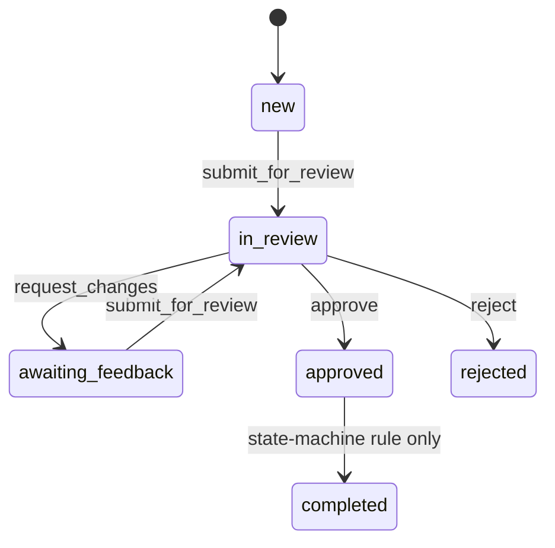
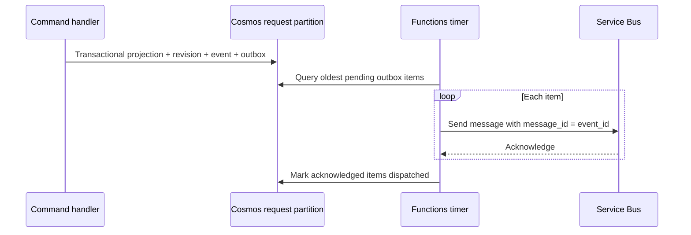

# Intake Agent Developer Guide

This guide is the code-first entry point for developers joining the project. It
explains what the Intake Agent currently does, which components participate in
each feature, how data moves through those components, where the safety
boundaries are, and where to make common changes.

`architecture.md` and `productbacklog.md` describe the broader target design.
Some of that target design is intentionally ahead of the implementation. This
guide labels current behavior as **Implemented**, **Partial**, or **Scaffold**
so that planned behavior is not mistaken for working code.

## 1. Start here

### 1.1 First local setup

From the repository root:

```bash
python3 -m venv .venv
source .venv/bin/activate
python -m pip install --upgrade pip
python -m pip install -e ".[dev]"
python -m pytest tests evaluation -q
```

On Windows PowerShell, activate the environment with:

```powershell
.\.venv\Scripts\Activate.ps1
```

No Azure credentials are required for the default test suite or local HTTP API.

### 1.2 Pick the right runtime

| What you want to exercise | Command | Main entry point |
|---|---|---|
| Deterministic API and domain flow | `intake-demo` | `src/intake_agent/main.py` |
| API with live reload | `python -m uvicorn intake_agent.main:app --reload --port 8000` | `src/intake_agent/main.py` |
| Browser chat backed by a Foundry model | `intake-devui` | `src/intake_agent/devui.py` |
| Teams cards, parser, and local auth guards | `PYTHONPATH=src python -m intake_teams.demo --verbose` | `src/intake_teams/demo/` |
| Deployed Responses-protocol agent | `python hosted_main.py` | `hosted_main.py` -> `src/intake_agent/hosted.py` |
| Target private requester tool service | Deployed with the application after ADR-015 implementation | `src/intake_mcp/` (planned) |
| Azure Functions workers | Deployed by `azd deploy` | `src/intake_workers/function_app.py` |

The local API is the fastest way to understand the deterministic behavior. Use
DevUI only after the local API flow makes sense, because DevUI adds model and
Foundry behavior around the same application service.

## 2. What is implemented today

| Capability | Status | Current behavior |
|---|---|---|
| JSON Schema intake template | Implemented | Loads, validates, flattens, and versions the packaged `general-intake-v1` schema. |
| Request creation and resume | Implemented | Resolves one request from tenant plus conversation and creates revision 1 atomically. |
| Field capture and validation | Implemented | Accepts valid fields, rejects invalid fields, tracks confidence, and increments revisions. |
| Gap analysis | Partial | Detects missing required fields and low-confidence values. Contradictory and ambiguous gap categories exist but are not detected yet. |
| Quality scoring | Implemented | Computes filled leaf fields divided by all template leaf fields. |
| Submission for review | Implemented | Enforces state, revision, blocking-gap, and quality checks, then freezes the revision. |
| Review decisions | Partial | Works through the local development adapter for approve, reject, and request changes. It is deliberately absent from Hosted Agent tools until verified reviewer claims are available. |
| Foundry Hosted Agent | Implemented for requester actions | Exposes context, one-field update, submit, and list tools over the Responses protocol. |
| Local FastAPI API | Implemented | Exposes the complete local command flow, including a development-only review route. |
| Agent Framework DevUI | Implemented for local development | Uses the Hosted Agent instructions and tools with a fixed local identity. |
| In-memory persistence | Implemented | Mirrors request, ETag, outbox, and idempotency interfaces for local use and tests. |
| Cosmos DB persistence | Implemented | Uses managed identity and transactional batches for projection, revision, audit event, and outbox. |
| Service Bus outbox dispatch | Implemented | Publishes pending events with at-least-once delivery and marks only acknowledged events dispatched. |
| Blob artifact adapter | Implemented but not wired to a worker | Supports create-only versioned writes, checksum replay detection, and short-lived delegated URLs. |
| Document and notification workers | Scaffold | Functions decode and log messages; document generation and notification delivery are not implemented. |
| Domain-event routing worker | Scaffold | The trigger receives events but does not route them to downstream queues or handlers. |
| Teams contracts, cards, and parser | Partial | Static assets and parsing are testable locally; there is no production webhook/channel composition. |
| Teams production authentication | Scaffold, fail closed | Production JWT verification always returns a configuration error until a JWKS validator is implemented. |
| Evaluation | Implemented for local scorecards and Foundry smoke configuration | Local scoring and threshold tests exist; deployed release orchestration remains environment-dependent. |
| Azure infrastructure | Implemented as Bicep and azd configuration | Modules, feature gates, packaging hooks, preflight, and verification scripts are present. Deployment still depends on subscription, networking, provider, and RBAC readiness. |
| Private requester MCP and Foundry Toolbox | Runtime and Azure deployment implemented; tenant bootstrap required | The streamable-HTTP service, strict Entra validation, Toolbox client, internal Container App, separate data identity, and guarded RBAC cutover are implemented. An administrator must still create the secure Foundry OAuth connection/Toolbox, complete delegated-user consent verification, and approve cutover. |

## 3. System mental model

### 3.1 Runtime flow



The model never receives a Cosmos client, managed identity, repository object,
role assignment, or arbitrary request ID. The model can invoke only the tools
created in `create_intake_tools()`. Those tools call `HostedRuntime`, which
injects the platform-derived actor and then calls `IntakeApplication`.

That final sentence describes the current in-process implementation. ADR-015
replaces it for deployed requester tools: the Hosted Agent consumes a versioned
Foundry Toolbox, the private MCP validates a same-tenant delegated token, and
the MCP workload identity calls the application/persistence layer. The local
adapter remains only for local tests and DevUI.

### 3.2 Package dependency direction

```text
intake_agent       -> intake_domain + intake_persistence
intake_persistence -> intake_domain
intake_workers     -> intake_domain + intake_persistence
intake_teams       -> standalone adapter contracts and assets
intake_domain      -> no intake package and no Azure SDK
```

These rules are configured in `pyproject.toml` and checked with
`lint-imports`. Keep domain decisions in `intake_domain`; keep Azure SDK calls
in `intake_persistence`; keep channel and model composition in `intake_agent`.

### 3.3 Main component call chain

| Component | Receives | Calls | Returns or persists |
|---|---|---|---|
| `hosted_main.py` | Process startup | `intake_agent.hosted.run()` | Starts the Responses server |
| `IntakeResponsesHostServer` | Foundry Responses request and isolation context | `HostedRuntime.bind_actor()` and Agent Framework | Streamed Responses output |
| `HostedRuntime` | Tool operation with a bound actor | `IntakeApplication` | Domain result dictionaries |
| `LocalAdapter` | Development-only user and conversation values | `IntakeApplication` | Domain result dictionaries |
| `IntakeApplication` | Actor plus application-level arguments | Typed command handlers | Stable command results |
| Command handler | Command envelope, actor, typed data | Domain services and repository protocols | State change, event, outbox, idempotency result |
| Repository protocol | Domain entities | In-memory or Azure implementation | Durable or ephemeral state |
| Functions outbox dispatcher | Timer trigger | Cosmos outbox and Service Bus | Dispatched markers |
| Teams parser | Verified `TeamsActivity` | No backend package | Backend-shaped command envelope |

## 4. Domain vocabulary and lifecycle

### 4.1 Core records

| Record | Purpose |
|---|---|
| `Request` | Current projection: owner, tenant, conversation, status, current revision, template, and ETag. |
| `RequestRevision` | Field values, gaps, quality metadata, version metadata, and immutability for one revision. |
| `FieldValue` | Value plus source reference, model confidence, and validation status. |
| `Gap` | Deterministic issue tied to a field, category, severity, and status. |
| `WorkflowEvent` | Audit record describing the command, actor, state change, revision, and correlation ID. |
| `OutboxItem` | Publishable event written with state and dispatched later. |
| `StoredResult` | Replay-safe command result stored under request scope and idempotency key. |
| `TemplateVersion` | Immutable flattened view of the canonical JSON Schema. |

### 4.2 Implemented state transitions



`approved -> completed` exists in `LifecycleService`, but no application command
currently invokes it. `rejected` and `completed` are terminal in the current
state machine. Draft fields are mutable only in `new` and
`awaiting_feedback`.

## 5. Feature workflows

### 5.1 Template loading and field definitions

**Status:** Implemented.

**Components**

| Component | Responsibility |
|---|---|
| `src/intake_domain/template_schemas/general-intake-v1.schema.json` | Canonical request contract. |
| `src/intake_domain/template_schema.py` | Validates the supported JSON Schema subset and flattens nested leaves. |
| `InMemoryTemplateRepository` | Seeds and selects active local templates. |
| `CosmosTemplateRepository` | Reads immutable versions and seeds the packaged schema on first use. |
| `build_repositories()` | Selects the repository and initiates local seeding. |

**Workflow**

1. Configuration selects `INTAKE_TEMPLATE_ID`, defaulting to
   `general-intake-v1`.
2. Local composition loads the packaged schema and seeds
   `InMemoryTemplateRepository`.
3. Cosmos composition queries the active schema document in the `templates`
   container.
4. If Cosmos has no active version, `CosmosTemplateRepository` loads the
   packaged schema and creates `version:{version}` through managed identity.
5. `template_from_json_schema()` validates Draft 2020-12, root metadata, object
   closure, supported keywords, types, and confidence/quality thresholds.
6. Nested leaf properties become dotted domain paths such as
   `project.name`.
7. New requests pin the selected template version. Later changes to the active
   template do not silently change an existing request.

**Current template**

| Field path | Required | Domain type |
|---|---:|---|
| `project.name` | Yes | string |
| `project.description` | Yes | string |
| `requester.business_unit` | Yes | string |
| `budget.amount` | No | number |
| `timeline.target_date` | No | string |
| `priority` | Yes | enum |

The current quality threshold is `0.7`. With six leaf fields, at least five
non-null values are needed to meet the quality threshold, even though only four
fields are required.

**Supported schema subset**

- Nested objects with `additionalProperties: false`.
- Leaf types `string`, `number`, `integer`, and `boolean`.
- String enums, titles, descriptions, `format`, defaults, and `x-intake`
  metadata.
- No arrays, `$ref`, `allOf`, `anyOf`, `oneOf`, conditional schemas, or unknown
  keywords.

`format` is preserved as schema metadata but is not currently enforced by
`ValidationService`; for example, any string currently passes the
`timeline.target_date` field-level validator.

**When changing a template**

1. Edit the JSON Schema, not Python seed data.
2. Increment the root `x-intake.version`.
3. Add or update `tests/unit/test_template_schema.py`.
4. Add validation and gap tests if the change requires new runtime semantics.
5. Keep old versions readable because existing requests pin their version.

### 5.2 Create or resume a request

**Status:** Implemented.

**Components**

| Component | Responsibility |
|---|---|
| `HostedRuntime.get_context()` or `LocalAdapter.get_or_create_request()` | Supplies trusted actor context. |
| `IntakeApplication.get_or_create_request()` | Selects the configured template. |
| `GetOrCreateRequestHandler` | Derives identity, loads the template, and constructs the aggregate. |
| `RequestRepository.get_or_create()` | Performs atomic conditional creation. |

**Workflow**

1. The adapter constructs `ActorContext` outside model-controlled arguments.
2. The handler hashes `tenant_id:conversation_id` and keeps the first 32 hex
   characters as `request_id`.
3. The active template is loaded.
4. `RequestRepository.get_or_create()` checks or conditionally creates the
   request.
5. A new request starts in `new` at revision `1`.
6. An empty revision `1` is created with the pinned template version.
7. The result reports `created`, status, revision, template ID, and template
   version.

The in-memory implementation protects creation with an `asyncio.Lock`. Cosmos
uses a transactional create batch and resolves a concurrent `409` by reading
the winning request.

**Resume semantics**

- Same tenant plus same conversation -> same request.
- Same tenant plus a different conversation -> different request.
- A new Foundry session that keeps the conversation can reload durable request
  state.
- A new Foundry conversation creates a different request.
- Local in-memory state disappears when the process stops.

**Current implementation note**

Creation does not emit a `RequestCreated` workflow event even though that event
appears in the broader event contract. The first currently emitted event is a
field update, submission, or review decision.

### 5.3 Read authoritative context

**Status:** Implemented.

**Components**

| Component | Responsibility |
|---|---|
| `GetRequestContextHandler` | Joins request, revision, template, gaps, quality, and actions. |
| `GapDetectionService.compute_quality_score()` | Computes the current filled-field ratio. |
| `LifecycleService.allowed_actions()` | Derives actions from status and actor roles. |

**Workflow**

1. Load the request projection by ID.
2. Load the current revision.
3. Load the exact template version pinned to the request.
4. Read the gaps already persisted on the revision.
5. Recompute quality from non-null field values.
6. Derive allowed actions from lifecycle status and actor roles.
7. Return fields, gaps, blocking-gap count, quality, allowed actions, and
   `can_submit`.

`can_submit` is true only when:

- no open blocking gaps exist;
- status is `new` or `awaiting_feedback`; and
- quality meets the template threshold.

The initial empty revision does not receive missing-field gaps during creation
or context reads. Missing gaps are first materialized after a field-update
command runs gap detection.

The context response currently contains captured fields, not the full template
field catalog. If a new channel needs to render an empty form, load the template
through a dedicated application query rather than inferring field paths.

### 5.4 Capture and validate fields

**Status:** Implemented, with intentionally narrow validation.

**Components**

| Component | Responsibility |
|---|---|
| `IntakeApplication.propose_updates()` | Builds a command envelope and typed update data. |
| `ProposeFieldUpdatesHandler` | Coordinates replay, concurrency, validation, gaps, persistence, and events. |
| `ValidationService` | Validates field existence and basic number, enum, boolean, and required rules. |
| `GapDetectionService` | Detects missing required values and low-confidence values. |
| Request, outbox, and idempotency repositories | Persist the result. |

**Workflow**

1. `IntakeApplication` creates a command ID, correlation data, actor payload,
   and a new random idempotency key.
2. The handler checks the idempotency store using request ID plus key.
3. The request is loaded and `expected_revision` must equal
   `Request.current_revision`.
4. `LifecycleService` confirms the request is editable.
5. The pinned template and current revision are loaded.
6. Every candidate is validated independently:
   - unknown field -> rejected;
   - non-numeric value for a number -> rejected;
   - value outside an enum -> rejected;
   - unsupported boolean representation -> rejected;
   - otherwise -> accepted.
7. Accepted values replace the field's current value and retain source and
   confidence metadata.
8. Open gaps for accepted fields are marked resolved.
9. Gap detection adds missing required-field gaps and low-confidence warnings.
10. The command increments the revision and updates request timestamps.
11. A `RequestFieldsUpdated` workflow event is created.
12. Persistence writes the request, revision, event, and outbox record.
13. The result is stored for idempotent replay.
14. The caller receives accepted fields, rejected fields, resolved gaps, new
    gaps, and the new revision.

Mixed batches return `partial`: valid values are committed while invalid values
are reported. The current handler increments the revision even when every field
in a batch is rejected, so callers must always use the revision returned by the
command.

**Gap behavior**

| Gap type | Current behavior |
|---|---|
| Missing required field | Open, blocking gap |
| Low model confidence | Open warning gap |
| Contradictory value | Enum exists, detection not implemented |
| Ambiguous value | Enum exists, detection not implemented |
| Warning acknowledgement | Teams parser can create the command, application handler not implemented |

### 5.5 Submit for human review

**Status:** Implemented.

**Components**

| Component | Responsibility |
|---|---|
| `SubmitForReviewHandler` | Enforces replay, concurrency, state, completeness, and quality. |
| `LifecycleService` | Allows `new` or `awaiting_feedback` to transition to `in_review`. |
| `GapDetectionService` | Checks blocking gaps and computes quality. |
| Request and outbox persistence | Freezes and records the submitted revision. |

**Workflow**

1. Check for a stored idempotent result.
2. Load the request.
3. Reject a stale `expected_revision`.
4. Validate the transition to `in_review`.
5. Load the current revision and pinned template.
6. Reject submission if any blocking gap remains open.
7. Reject submission if quality is below the template threshold.
8. Mark the existing revision `immutable=True`.
9. Change request status to `in_review` without incrementing the revision.
10. Persist a `RequestSubmitted` event and outbox record with the quality score.
11. Store and return the replay-safe result.

Warning gaps do not block submission. A second submission from `in_review` is
rejected by the state machine.

### 5.6 Record a review decision

**Status:** Partial. The domain handler and local development route work; the
Hosted Agent intentionally does not expose this operation.

**Components**

| Component | Responsibility |
|---|---|
| `LocalAdapter._resolve_local_dev_actor()` | Grants a local reviewer role only to configured IDs. |
| `RecordReviewDecisionHandler` | Checks reviewer/admin role, validates the decision, and changes state. |
| `LifecycleService` | Enforces the `in_review` transition. |
| Request and outbox persistence | Saves the decision event and new projection. |

**Workflow**

1. The local adapter checks `INTAKE_ENVIRONMENT=local`.
2. It grants `reviewer` only when the supplied reviewer ID is in
   `INTAKE_LOCAL_DEV_REVIEWER_IDS`.
3. The handler checks the idempotency store and loads the request.
4. Only a `reviewer` or `admin` role may continue.
5. The decision is mapped:
   - `approve` -> `approved`;
   - `reject` -> `rejected`;
   - `request_changes` -> `awaiting_feedback`.
6. The state machine verifies that the request is currently `in_review`.
7. The request status and timestamp are updated.
8. A `RequestApproved`, `RequestRejected`, or `ChangesRequested` event is
   persisted with reviewer ID and rationale.
9. The result is stored for replay.

After `request_changes`, field updates are allowed again. A subsequent submit
returns the request to `in_review`.

**Security boundary**

- The local review route is not authenticated and must never be deployed.
- Non-local use of `LocalAdapter.record_review_decision()` fails immediately.
- Hosted tools expose no review operation.
- Teams production review remains blocked until activity claims can be mapped
  to verified reviewer roles.

**Current implementation notes**

- The handler checks the `reviewer` or `admin` role, not reviewer assignment to
  a specific request.
- `expected_revision` is present in the public method and command envelope but
  is not explicitly compared in `RecordReviewDecisionHandler`. The repository
  ETag still protects a concurrent save, but a stale caller revision alone does
  not reject the decision.
- Review decisions are represented by state plus workflow event; the `Review`
  entity is not persisted by the current handler.

### 5.7 List and recover requests

**Status:** Implemented.

**Components**

| Component | Responsibility |
|---|---|
| `ListRequestsHandler` | Queries requests by actor user and tenant. |
| `RequestRepository.list_by_user()` | Applies owner and tenant filters. |
| `list_my_intake_requests` tool | Exposes the scoped list to the Hosted Agent. |

**Workflow**

1. The adapter supplies the current actor.
2. The repository queries by `requester_id` and `tenant_id`.
3. Cosmos orders results by most recently updated.
4. The result includes ID, status, revision, template ID, and timestamps.
5. The model can describe the list but cannot pass an arbitrary identity to the
   tool.

For active conversational work, the Hosted Agent still resolves the current
request from the current conversation. Listing does not switch the current
conversation to an arbitrary request.

### 5.8 Foundry Hosted Agent conversation

**Status:** Current in-process requester implementation; approved for extraction
to private MCP but not yet cut over.

**Components**

| Component | Responsibility |
|---|---|
| `hosted_main.py` | Direct-code deployment entry point. |
| `build_responses_server()` | Builds credentials, Foundry client, agent, runtime, and host. |
| `IntakeResponsesHostServer` | Binds platform isolation around each streamed request. |
| `HostedRuntime` | Converts isolation keys to an opaque actor and invokes the application. |
| `AGENT_INSTRUCTIONS` | Defines source-of-truth, extraction, submission, and security behavior. |
| `create_intake_tools()` | Defines the only model-callable operations. |

**Request workflow**

1. Foundry sends a Responses-protocol request with user and chat isolation.
2. `IntakeResponsesHostServer` extracts the platform isolation keys.
3. `HostedRuntime` rejects missing isolation outside local development.
4. The runtime hashes tenant plus user isolation into an opaque user ID and
   builds a requester-only `ActorContext`.
5. A context variable binds that actor for the current asynchronous request.
6. Agent Framework runs the model and any tool calls.
7. Each tool obtains the bound actor; identity is never a model argument.
8. The actor binding is reset in `finally`, including streamed failure paths.

**Available tools**

| Tool | Purpose |
|---|---|
| `get_intake_context` | Creates/resumes and then loads authoritative state. |
| `update_intake_field` | Sends one explicit value through deterministic validation. |
| `submit_intake_for_review` | Submits only the current request and revision. |
| `list_my_intake_requests` | Lists requests for the platform-isolated user. |

The agent instructions require a context read before state claims, one focused
question for ambiguous data, a fresh context after updates, and explicit user
confirmation before submission.

**Startup workflow**

1. `.env` is loaded only as a local configuration source; existing environment
   values win.
2. `FOUNDRY_PROJECT_ENDPOINT` and
   `AZURE_AI_MODEL_DEPLOYMENT_NAME` are required.
3. Non-local environments require tenant ID, user-assigned managed identity,
   Cosmos, Blob, and Service Bus configuration.
4. `DefaultAzureCredential` authenticates the Foundry client and Azure
   repositories.
5. The host exposes `/responses`, `/health`, and SDK readiness behavior.

**ADR-015 target workflow**

1. The Hosted Agent authenticates to Foundry with its workload identity and
   consumes a pinned, versioned Toolbox.
2. Toolbox manages the custom OAuth connection, user consent, token refresh,
   and private MCP selection.
3. The MCP boundary validates signature, exact issuer/tenant, MCP audience,
   lifetime, and `Intake.Tools.ReadWrite`.
4. Only validated `tid` and `oid`, plus trusted bounded protocol metadata,
   produce `ActorContext`; caller/model identity, roles, request IDs,
   correlation IDs, idempotency IDs, and authorization decisions are rejected.
5. A separate MCP managed identity accesses Cosmos, Blob, and Service Bus. The
   user token is not forwarded.
6. Toolbox/OAuth/MCP failure is explicit in deployed environments; there is no
   in-process or local fallback.

The four names and behavioral contract remain
`get_intake_context`, `update_intake_field`,
`submit_intake_for_review`, and `list_my_intake_requests`. Reviewer operations
remain unavailable.

### 5.9 Local HTTP API and DevUI

#### Local HTTP API

**Status:** Implemented for development and integration tests.

FastAPI lifespan loads settings, builds repositories, creates `LocalAdapter`,
and configures structured logging.

| Method | Route | Adapter call |
|---|---|---|
| `GET` | `/health` | None |
| `POST` | `/requests` | `get_or_create_request` |
| `GET` | `/requests` | `list_requests` |
| `GET` | `/requests/{request_id}` | `get_context` |
| `POST` | `/requests/{request_id}/fields` | `propose_updates` |
| `POST` | `/requests/{request_id}/submit` | `submit_for_review` |
| `POST` | `/requests/{request_id}/review` | `record_review_decision` |

Domain errors map to HTTP responses:

| Error | HTTP status |
|---|---:|
| Not found | 404 |
| Authorization denied | 403 |
| Conflict | 409 |
| Validation, transition, or precondition failure | 422 |
| Other domain or internal failure | 500 |

The caller-supplied `user_id` and `reviewer_id` are development fixtures, not
authentication. The API binds only to loopback through the `intake-demo` CLI
and must not become a production ingress.

#### DevUI

**Status:** Implemented for loopback-only local use.

1. Install `python -m pip install -e ".[devui]"`.
2. Copy `.env.example` to `.env` and fill only the Foundry endpoint and model
   deployment placeholders.
3. Run `az login`.
4. Run `intake-devui`.
5. DevUI creates a random UI authentication token and binds to `127.0.0.1`.
6. It uses `FoundryChatClient` for model calls and a fixed local isolation
   identity for deterministic tools.
7. Repository selection still follows `IntakeSettings`; the default is
   in-memory.

DevUI refuses to start unless `INTAKE_ENVIRONMENT=local`. Its optional package
is not installed in the production Hosted Agent build.

### 5.10 Persistence, concurrency, and idempotency

**Status:** Implemented at the repository and handler layers.

**Protocol mapping**

| Protocol | Local implementation | Azure implementation |
|---|---|---|
| `RequestRepository` | `InMemoryRequestRepository` | `CosmosRequestRepository` |
| `TemplateRepository` | `InMemoryTemplateRepository` | `CosmosTemplateRepository` |
| `OutboxRepository` | `InMemoryOutboxRepository` | `CosmosOutboxRepository` |
| `IdempotencyStore` | `InMemoryIdempotencyStore` | `CosmosIdempotencyStore` |
| `ArtifactStore` | `InMemoryArtifactStore` | `BlobArtifactStore` |

**Cosmos request partition workflow**

The configured request-state container is partitioned by `/requestId`. One
transactional batch writes:

1. the request projection with `if_match_etag`;
2. the current `revision:{revision}` document;
3. one `event:{event_id}` audit document per event; and
4. one `outbox:{event_id}` document per event.

Because all records share `requestId`, state and the event to publish cannot
diverge after a successful batch.

**Optimistic concurrency**

1. Mutating handlers compare the caller's expected revision where implemented.
2. The repository receives the ETag read with the projection.
3. A concurrent writer changes the ETag.
4. Cosmos rejects the stale batch with `412`.
5. The adapter maps the failure to `ConflictError` with current revision and
   current ETag.

The in-memory repository rotates synthetic ETags under a lock so local and
component tests exercise the same winner/loser behavior.

**Idempotency**

1. A handler checks request scope plus idempotency key before side effects.
2. A hit returns the original stored result.
3. A miss executes, persists, and stores the result for seven days by default.
4. Cosmos uses `/scopeId` partitioning and item-level TTL.
5. Reusing a key with different durable content is rejected as a collision.

The handler contracts support caller-stable idempotency keys. The current
`IntakeApplication` creates a new UUID for each public adapter call, so an HTTP
or model-tool retry does not currently reuse a key supplied by the original
caller. Preserve the handler behavior when adding a stable transport-level key.

### 5.11 Domain events, outbox, and workers

**Status:** Outbox persistence and dispatch are implemented; downstream event
processing is scaffolded.

**Implemented outbox workflow**



The Service Bus message carries:

- JSON event envelope as the body;
- `message_id=event_id`;
- event type as subject and application property;
- request ID as an application property; and
- correlation ID when present.

If a send fails partway through a batch, already acknowledged IDs are marked
dispatched before a transient or permanent domain error is raised. Remaining
items stay pending for at-least-once retry.

**Worker triggers**

| Function | Trigger | Current behavior |
|---|---|---|
| `outbox_dispatcher` | Timer | Builds Cosmos/Service Bus adapters and dispatches pending items. |
| `domain_event_dispatcher` | Configured domain-event queue | Decodes and logs the body; routing is not implemented. |
| `document_worker` | `document-generation` queue | Decodes and logs the body; generation is not implemented. |
| `notification_worker` | `notification-queue` queue | Decodes and logs the body; delivery is not implemented. |

There is no integration or completion worker implementation yet. Do not treat
the target workflows in `architecture.md` as executable until handlers,
contracts, triggers, retry policy, dead-letter handling, and tests are added.

### 5.12 Artifact storage

**Status:** Storage adapter implemented; feature workflow not composed.

**Implemented adapter workflow**

1. A caller supplies request ID, positive revision, bytes, and matching
   `ArtifactMetadata`.
2. `BlobArtifactStore` validates that the filename is a safe basename.
3. The blob path is `{request_id}/{revision}/{filename}` with URL-safe
   segments.
4. SHA-256, request, revision, artifact type, agent version, and schema version
   are stored as metadata.
5. Upload uses `overwrite=False`.
6. An existing blob with the same checksum is an idempotent success.
7. An existing blob with different content raises `ConflictError`.
8. Read access uses a managed-identity user delegation key and a one-to-sixty
   minute SAS URL.

`IntakeApplication` currently receives `artifact_store` but does not use it,
and `document_worker` does not invoke it. A complete document feature still
needs immutable-revision loading, generation, validation, storage, result
recording, and event emission.

### 5.13 Teams assets and adapter boundary

**Status:** Partial and intentionally isolated from the backend packages.

**Components**

| Component | Responsibility |
|---|---|
| `intake_teams.adapter.contracts` | Pydantic Activity, command, and response shapes. |
| `ActivityParser` | Maps message and Adaptive Card activities to command envelopes. |
| `AuthBoundary` | Local bypass guard and fail-closed production boundary. |
| `intake_teams.cards` | Loads static Adaptive Card templates. |
| `intake_teams.demo` | Exercises cards, parsing, and auth guards without Azure. |

**Parser workflow**

1. A future webhook must authenticate the Bot Framework request first.
2. The payload is validated as `TeamsActivity`.
3. User, tenant, conversation, activity, and service values are derived from
   Activity metadata.
4. `ActivityParser` hashes tenant plus conversation into a request ID.
5. It maps the activity to a backend-shaped command:

| Activity | Command |
|---|---|
| Text message | `get_or_create_request` |
| `capture_field` | `propose_field_updates` |
| `submit_request` | `submit_for_review` |
| `review_decision` | `record_review_decision` |
| `acknowledge_gaps` | `acknowledge_gaps` |

6. A future composition layer must map the standalone command envelope into
   `IntakeApplication` calls and render a response.

**Current boundaries**

- There is no Teams webhook host or production `FoundryAdapter`.
- Production `_verify_jwt()` validates only JWT shape and then raises
  `ConfigurationError`; it never accepts an unverified token.
- Local bypass requires explicit dev mode and refuses Azure Functions/App
  Service or production signals.
- Relay-token verification is not implemented.
- Cards are static templates; no production presenter binds data to them.
- `acknowledge_gaps` has a parser mapping but no domain/application handler.
- Teams publication still requires tenant, Bot Service, manifest, consent, and
  admin work described in `docs/teams/publishing-spike.md`.

### 5.14 Evaluation and quality gates

**Status:** Implemented for local tests, scorecards, and Foundry smoke
configuration.

**Local test layers**

| Marker | Scope |
|---|---|
| `unit` | Entities, services, schema, auth rules, and static checks |
| `component` | Handlers and persistence behavior with fakes/in-memory adapters |
| `contract` | Commands, events, repository APIs, and Hosted Agent surface |
| `integration` | Local adapter, HTTP API, and Functions composition |
| `security` | Identity, authorization, isolation, and injection cases |
| `accessibility` | Adaptive Card structure and semantics |
| `evaluation` | Dataset and scorecard behavior |
| `azure` | Explicitly enabled live Azure verification |

**Common commands**

```bash
python -m pytest tests evaluation -q
python -m pytest tests/unit tests/component tests/contract -q
python -m pytest tests/integration/test_vertical_flow.py -q
python -m pytest tests/teams -q
python -m ruff check src tests evaluation
python -m mypy src
lint-imports
```

**Scorecard workflow**

1. `evaluation/dataset/cases.jsonl` supplies expected captures and gaps.
2. A result JSONL supplies actual captures, gaps, and raw responses.
3. `evaluation.scorecard` normalizes values and scores each case.
4. Aggregate metrics are compared with frozen thresholds:
   capture accuracy, gap recall, gap precision, unsupported claims, and
   injection safety.
5. The CLI exits non-zero when any threshold fails.

`eval.yaml` separately configures a Foundry smoke evaluation using task
adherence, intent resolution, and indirect-attack evaluators.

Treat historical test totals written in older design documents as snapshots.
The current `pytest` result is authoritative.

The current `.github/workflows/ci.yml` marks its Python and security jobs
`continue-on-error` and runs only unit tests in the Python job. Run the complete
local commands above before opening a pull request; a green workflow alone does
not currently prove that every Python gate passed.

### 5.15 Azure provisioning and deployment

**Status:** Infrastructure and deployment definitions are present; execution is
environment-dependent.

**Components**

| Component | Responsibility |
|---|---|
| `infra/main.bicep` | Resource-group-scoped orchestration and azd outputs. |
| `infra/modules/` | Monitoring, network, identities, Key Vault, Storage, Cosmos, Service Bus, Search, Functions, Container Apps, Foundry, and Bot modules. |
| `azure.yaml` | Foundry agent, Functions, Bicep, environment, and packaging contract. |
| `scripts/azure/preflight.*` | Checks subscription, providers, RBAC signals, quota, and region readiness. |
| `scripts/azure/post-deploy-verify.*` | Checks resources, data shape, queues, identities, Functions, and network. |

ADR-015 adds a target private MCP Container App to the **existing** Container
Apps managed environment and a dedicated MCP user-assigned identity. It does
not imply these resources or verification steps exist yet.

**Feature gates**

| Bicep parameter | Default | Purpose |
|---|---:|---|
| `deployFoundry` | `false` | Create Foundry account, project, model, and capability host. |
| `deployBotService` | `false` | Create Bot Service and Teams channel after the publishing/auth spike is resolved. |
| `deployPrivateEndpoints` | `false` | Enable the complete private data-plane topology after connectivity validation. |
| `deployStoragePrivateEndpoint` | `false` | Enable only the storage private endpoint needed by the FC1 deployment path. |

**azd workflow**

1. Authenticate with Azure CLI and azd.
2. Select or create an azd environment.
3. Run the preflight hook.
4. Review `azd provision --preview --no-prompt`.
5. Run `azd provision --no-prompt`.
6. `infra/main.bicep` deploys modules into the existing resource group and
   exports service configuration.
7. Run `azd deploy --no-prompt`.
8. The Hosted Agent remote build installs the root `requirements.txt` and
   starts `hosted_main.py` on Python 3.13.
9. The Functions prepackage hook copies `intake_domain` and
   `intake_persistence` beside `function_app.py`; the worker runs on Python
   3.11.
10. Run post-deploy verification and a private-network Hosted Agent smoke test.

All runtime service authentication uses managed identity. Do not add account
keys, connection strings, client secrets, or Service Bus SAS policies.

The custom OAuth credential is the exception only in the sense that Foundry
requires a client credential for the project connection: it belongs solely in
an approved secret store/Foundry connection, never application configuration,
source, logs, Bicep output, or azd output. Entra app registrations, scopes,
redirect URIs, preauthorization, and consent are tenant-scoped and must be set
up separately from resource-group-scoped Bicep.

## 6. Configuration model

### 6.1 Local defaults

| Setting | Default |
|---|---|
| `INTAKE_ENVIRONMENT` | `local` |
| `INTAKE_PERSISTENCE_BACKEND` | `inmemory` |
| `INTAKE_BLOB_BACKEND` | `inmemory` |
| `INTAKE_SERVICEBUS_BACKEND` | `inmemory` |
| `INTAKE_TEMPLATE_ID` | `general-intake-v1` |

Use `.env.example` as the schema for DevUI configuration. Do not read, commit,
or copy values from another developer's `.env`.

### 6.2 Deployed fail-closed checks

Any non-local Hosted Agent requires:

- `INTAKE_HOSTED_TENANT_ID`;
- `AZURE_CLIENT_ID`;
- Cosmos backend and endpoint/container configuration;
- Azure Blob backend and endpoint; and
- Azure Service Bus backend and namespace.

If a deployed runtime selects an in-memory backend or omits required Azure
values, startup raises `IntakeConfigurationError` instead of silently losing
state.

After MCP cutover, non-local startup additionally requires an overlapping
Toolbox/MCP contract version, private MCP endpoint, exact tenant/issuer/audience
and delegated-scope configuration, and the MCP managed identity. Missing values
fail closed. Production cannot select the local/in-process adapter.

See `docs/contracts/infrastructure-config.md` for the complete environment,
container, partition-key, package, and RBAC contract.

## 7. Common change recipes

### 7.1 Add or change a request field

1. Change the canonical JSON Schema and increment its version.
2. Update schema adaptation tests.
3. Add domain validation only if the existing primitive rules are insufficient.
4. Add gap tests for any new completeness or confidence rule.
5. Update evaluation cases and Teams cards if the field is user-visible there.
6. Confirm old pinned template versions remain readable.

### 7.2 Add a deterministic business rule

1. Put the rule in `intake_domain/services`, not in the prompt.
2. Return a typed domain result or domain error.
3. Call it from the relevant command handler.
4. Add unit tests for the rule and component tests for handler behavior.
5. Update context output if users or the model need to see the result.

### 7.3 Add a mutating command

1. Add typed input in `intake_domain/commands`.
2. Implement a handler with actor, idempotency, precondition, concurrency,
   persistence, event, and result handling.
3. Add or reuse a stable event type.
4. Expose an application method in `IntakeApplication`.
5. Expose it to a channel only if that channel can construct the required
   trusted actor and arguments.
6. Add unit, component, contract, integration, and authorization coverage.

Do not give the model a generic command bus, repository, URL fetcher, or
arbitrary actor fields.

### 7.4 Add a persistence adapter

1. Implement the protocol in `intake_domain.repositories`.
2. Preserve conditional create, ETag conflicts, idempotency, and typed error
   mapping.
3. Keep Azure imports in `intake_persistence`.
4. Add the selection branch to `build_repositories()`.
5. Add component tests with SDK fakes and a gated live-Azure test where needed.

### 7.5 Add a background worker

1. Define its input event contract and supported event versions.
2. Add a trigger in `intake_workers`.
3. Deserialize and validate before side effects.
4. Use a dedicated managed identity and least-privilege role.
5. Make the side effect idempotent by event or delivery ID.
6. Distinguish retryable, permanent, and poison-message failures.
7. Record the outcome through a domain command rather than patching Cosmos.
8. Add unit, contract, component, and deployed smoke tests.

### 7.6 Add or change a requester tool

1. Treat ADR-015's four-tool surface as closed; obtain architecture/security
   approval before adding a fifth tool.
2. Add or reuse a transport-neutral `IntakeApplication` port.
3. Keep identity, authorization, request, correlation, and idempotency context
   out of model-controlled signatures.
4. Use closed, bounded schemas and preserve structured error categories.
5. Additive optional changes increment the minor contract; removal, rename,
   semantic change, or newly invalid input requires a new major surface.
6. Update Hosted Agent, local adapter, MCP discovery/invocation, JWT,
   idempotency, compatibility, and end-to-end contract coverage together.
7. Maintain overlap between agent and MCP supported ranges during rollout.

### 7.7 Change Teams behavior

1. Keep Bot Framework types inside `intake_teams`.
2. Authenticate before parsing.
3. Update contracts and parser tests together.
4. Update the relevant Adaptive Card and accessibility tests.
5. Do not enable production mode until cryptographic JWT and relay-token
   validation are implemented and tested.

### 7.8 Change Azure infrastructure

1. Change the source `.bicep`, not generated `infra/main.json`.
2. Keep physical resource names in outputs and environment configuration.
3. Run Bicep build/lint and preflight.
4. Review a what-if or azd preview before applying.
5. Update `azure.yaml`, infrastructure contract docs, and post-deploy checks when
   an output or runtime setting changes.

## 8. Debugging by symptom

| Symptom | First checks |
|---|---|
| Field update returns `CONFLICT` | Reload context and retry with its `current_revision`; inspect concurrent writers. |
| Field update is `partial` | Read `rejected_fields`; verify exact dotted path, enum value, and primitive type. |
| Submit returns 422 | Inspect open blocking gaps, filled-field quality, status, and expected revision. |
| A required gap is absent on a brand-new request | Missing gaps are currently materialized after the first update, not at creation. |
| Hosted Agent refuses startup | Check Foundry endpoint/model, tenant ID, managed identity client ID, and all durable backend settings. |
| Hosted Agent cannot find user/chat scope | The deployed Responses request did not provide required isolation keys. Do not fall back to shared identity. |
| Toolbox returns `consent_required` | Confirm same tenant, OAuth connection/scope, and tenant consent policy; complete the approved user flow, never an app-only fallback. |
| MCP returns invalid token | Check signature, exact issuer/tenant, audience, lifetime, and delegated scope; do not weaken validation. |
| Toolbox cannot discover MCP tools | Check selected versions, readiness, private DNS/TLS, internal ingress, and Foundry private reachability; do not enable public ingress. |
| MCP data access fails | Check that `AZURE_CLIENT_ID` selects the separate MCP UAMI and verify its narrow data-plane roles; never forward the user token. |
| Agent and MCP contract ranges do not overlap | Stop rollout and select compatible releases; do not reinterpret schemas in prompts. |
| Local review returns 403 | Confirm local environment and exact membership in `INTAKE_LOCAL_DEV_REVIEWER_IDS`. |
| Teams production request returns 503 | Expected until JWKS validation is implemented; do not bypass the boundary. |
| Outbox records remain pending | Check Functions timer execution, Cosmos access, Service Bus sender role, namespace, queue, and transient errors. |
| Domain event is consumed but nothing happens | The domain-event dispatcher is currently a routing scaffold. |
| Document or notification queue is consumed but no output appears | Those workers currently only decode and log. |
| Cosmos transaction fails | Verify request-state partition key is `/requestId` and the configured container is the durable one. |
| Functions imports fail after deployment | Confirm the package contains `intake_domain/` and `intake_persistence/` beside `function_app.py`. |
| Public Foundry invocation gets 403 | Use the approved private network and DNS path; do not enable public access as a workaround. |

## 9. Documentation map

| Document | Use it for |
|---|---|
| `README.md` | Setup, invocation, validation, deployment, and operational quick reference |
| `docs/developer-guide.md` | Current feature and component workflows |
| `architecture.md` | Target system design, quality attributes, and longer-term workflows |
| `productbacklog.md` | Product scope and acceptance criteria |
| `docs/adr/ADR-012-package-module-boundaries.md` | Package dependency decisions |
| `docs/adr/ADR-013-domain-entities-and-vertical-flow.md` | Domain model and original vertical-slice decision |
| `docs/adr/ADR-014-teams-integration-boundary.md` | Why Teams is an isolated adapter boundary |
| `docs/adr/ADR-015-private-requester-mcp-boundary.md` | Requester MCP, identity, versioning, deployment, and ownership decision |
| `docs/operations/requester-mcp.md` | MCP consent, deployment gates, operations, troubleshooting, and rollback |
| `docs/contracts/command-event-schemas.md` | Command, error, event, and correlation contracts |
| `docs/contracts/repository-interfaces.md` | Persistence ports and implementation mapping |
| `docs/contracts/infrastructure-config.md` | Runtime environment, data shape, packaging, and RBAC |
| `docs/quality/test-strategy.md` | Test layers and release-quality intent |
| `docs/teams/publishing-spike.md` | Teams tenant, publishing, auth, and accessibility prerequisites |

When documents disagree with executable behavior, use this order:

1. tests that exercise the real implementation;
2. source code and configuration;
3. contracts and accepted ADRs;
4. architecture and backlog target-state descriptions.
